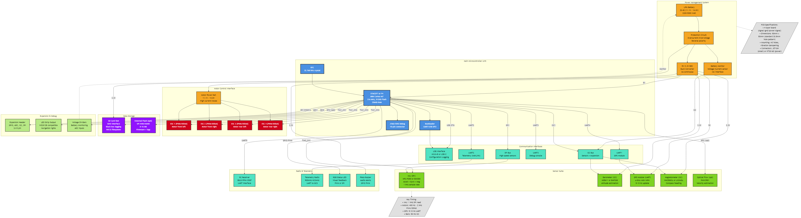

# Phase 5: Custom Hardware Platform
## Work Breakdown Structure - Detailed Execution Guide

---

**Document Information**

| Field | Value |
|-------|-------|
| **Document Title** | WBS Phase 5: Custom Hardware Platform |
| **Version** | 2.0 |
| **Date** | February 8, 2026 |
| **Author** | Ratan Lal Bunkar |
| **Status** | Active |
| **Phase** | 5.0 - Custom PCB Design and Fabrication |
| **WBS IDs Covered** | 5.0-5.7 (all subsections) |

---

### Document Navigation

- **Master Overview**: [00_WBS_Master_Overview.md](./00_WBS_Master_Overview.md)
- **Previous Phase**: [04_WBS_Phase4_HIL_Flight_Control.md](./04_WBS_Phase4_HIL_Flight_Control.md)
- **Next Phase**: [06_WBS_Phase6_Integration_Validation.md](./06_WBS_Phase6_Integration_Validation.md)
- **All Phases**: [See Master Overview Navigation Guide](./00_WBS_Master_Overview.md#15-navigation-to-detail-documents)

---

## Phase 5 Overview

### Scope and Objectives

Phase 5 (Stage 4) designs and fabricates custom flight controller hardware integrating the validated firmware from Phase 4. This phase includes hardware requirements specification, schematic design, PCB layout, BOM creation and sourcing, fabrication and assembly, and hardware bring-up validation. Success produces functional custom flight controller PCB ready for system integration.

#### Figure 5.1: Custom Hardware Architecture

*Figure 5.1 shows the complete custom flight controller PCB architecture with STM32 MCU, power management, sensor interfaces, motor drivers, and communication peripherals.*

### Total Duration and Effort

- **Duration**: 10-14 weeks (dominated by fabrication lead times: 6-10 weeks)
- **Total Effort**: 200 person-hours
- **Work Packages**: 29 Level 3 deliverables across 7 Level 2 subsystems

### Key Deliverables

1. Hardware requirements document
2. Complete schematic design
3. PCB layout files (Gerber, drill files)
4. Bill of Materials with sourced components
5. Fabricated and assembled PCBs
6. Hardware bring-up validation results
7. Stage 4 documentation package

### Prerequisites and Dependencies

- **Prerequisites**: Phase 4 (HIL Flight Control) complete with firmware architecture defined
- **Dependencies**: Phase 6 (Integration) requires functional hardware from this phase

### Required Resources

**Personnel**: Hardware designer (120h), Embedded engineer (40h), Procurement specialist (20h), Systems engineer (20h)

**Hardware**: PCB design workstation, measurement equipment (multimeter, oscilloscope, power supply)

**Software/Tools**: KiCad or Altium Designer, LTSpice for simulation, Gerber viewer

**Budget**: $1000-3000 (PCB fabrication $200-500, components $300-800, assembly $200-500, tools/equipment $300-1200)

### Success Criteria

✅ Custom PCB fabricated and assembled without major defects
✅ All power rails functional and within spec
✅ MCU boots and communicates
✅ Firmware flashes and executes successfully
✅ All Stage 4→Integration gate criteria satisfied

### Risk Summary

| Risk | Probability | Impact | Mitigation |
|------|------------|--------|------------|
| Long fabrication lead times | High | High | Order early, track proactively, consider fast-turn vendors |
| PCB design errors | Medium | High | Design reviews, DRC checks, prototype before production |
| Component availability/lead times | Medium | High | Source early, identify alternates, consider stocking |
| Assembly defects | Medium | Medium | Clear assembly docs, consider professional assembly |

---

## Detailed WBS Dictionary

### 5.0 STAGE 4: CUSTOM HARDWARE PLATFORM (Level 1)

**Duration**: 10-14 weeks | **Effort**: 200 person-hours

**Description**: Designs and fabricates custom flight controller PCB integrating MCU, power systems, sensor interfaces, and communication peripherals. Includes requirements, schematic, layout, sourcing, fabrication, assembly, and bring-up.

**Key Deliverables**: Hardware spec, schematic, PCB layout, BOM, fabricated boards, validation results

**Success Criteria**: PCB functional, power good, MCU boots, firmware executes

**Major Risks**: Fab lead times (High/High), design errors (Med/High), component availability (Med/High)

---

### Level 2 Subsystems and Level 3 Work Packages

#### 5.1 Requirements Specification (Duration: 1 week | Effort: 32h)

**Description**: Define complete hardware requirements including electrical, mechanical, environmental, and certification considerations.

| WBS ID | Work Package | Duration | Effort | Key Deliverables | Critical Success Factors |
|--------|--------------|----------|--------|------------------|-------------------------|
| 5.1.1 | Hardware Requirements Document | 2 days | 12h | Requirements spec, traceability to firmware | Power, I/O, mechanical, environmental requirements defined |
| 5.1.2 | Interface Requirements | 2 days | 8h | Interface specifications | Sensor interfaces (I2C, SPI), comm (UART/USB), motor outputs (PWM) |
| 5.1.3 | Environmental Requirements | 1 day | 4h | Operating conditions, stress factors | Temperature range, vibration, moisture, EMI considerations |
| 5.1.4 | Certification Considerations | 1 day | 4h | Regulatory analysis, compliance plan | FCC/CE if needed, design for testability |

---

#### 5.2 Schematic Design (Duration: 2 weeks | Effort: 56h)

**Description**: Create complete schematic including MCU, power supply, sensors, communication interfaces, and motor drivers.

| WBS ID | Work Package | Duration | Effort | Key Deliverables | Critical Success Factors |
|--------|--------------|----------|--------|------------------|-------------------------|
| 5.2.1 | Component Selection | 3 days | 16h | Component library, datasheets | MCU, voltage regulators, sensors, connectors selected and verified |
| 5.2.2 | Schematic Capture | 4 days | 20h | Complete schematic in CAD tool | All connections, proper symbols, hierarchical design |
| 5.2.3 | Power Supply Design | 3 days | 12h | Power tree, regulator circuit | 5V, 3.3V rails; adequate current capacity; ripple <50mV |
| 5.2.4 | Signal Conditioning Circuits | 2 days | 8h | Sensor interfaces, level shifters | Proper termination, filtering, protection circuits |

---

#### 5.3 PCB Layout (Duration: 2 weeks | Effort: 56h)

**Description**: Layout PCB with appropriate layer stackup, component placement, routing, and design rule compliance.

| WBS ID | Work Package | Duration | Effort | Key Deliverables | Critical Success Factors |
|--------|--------------|----------|--------|------------------|-------------------------|
| 5.3.1 | Layer Stackup Definition | 1 day | 8h | Stackup specification, impedance calcs | 4-layer recommended; power/ground planes, signal layers |
| 5.3.2 | Component Placement | 3 days | 16h | Placed components, mechanical checks | Logical placement, thermal considerations, accessibility |
| 5.3.3 | Routing | 5 days | 24h | Routed PCB, critical signals optimized | Power traces sized appropriately, signal integrity, EMI mitigation |
| 5.3.4 | Design Rule Checks | 1 day | 8h | DRC report, corrections | No DRC violations, clearances met, manufacturability verified |

---

#### 5.4 BOM & Sourcing (Duration: 1.5 weeks | Effort: 32h)

**Description**: Create bill of materials, select vendors, analyze costs, and assess component lead times.

| WBS ID | Work Package | Duration | Effort | Key Deliverables | Critical Success Factors |
|--------|--------------|----------|--------|------------------|-------------------------|
| 5.4.1 | Bill of Materials Creation | 2 days | 8h | Complete BOM with part numbers | All components listed, quantities, manufacturer part numbers |
| 5.4.2 | Vendor Selection | 2 days | 8h | Vendor list, distributor accounts | Digikey, Mouser, Arrow; pricing comparison |
| 5.4.3 | Cost Analysis | 1 day | 4h | Cost breakdown, budget validation | Per-unit and total costs; within budget |
| 5.4.4 | Lead Time Assessment | 2 days | 8h | Lead time report, critical items | Identify long-lead items; plan procurement timing |

---

#### 5.5 Fabrication & Assembly (Duration: 6-10 weeks | Effort: 24h human, 6-10 weeks calendar)

**Description**: Order PCB fabrication, procure components, execute assembly (manual or contract), and perform quality inspection.

| WBS ID | Work Package | Duration | Effort | Key Deliverables | Critical Success Factors |
|--------|--------------|----------|--------|------------------|-------------------------|
| 5.5.1 | PCB Fabrication Order | 1 day + 2-4 weeks fab | 4h | Gerber files submitted, fab tracking | Files correct, fab house selected, tracking number |
| 5.5.2 | Assembly Instructions | 2 days | 8h | Assembly drawings, BOM, process | Clear instructions for manual or contract assembly |
| 5.5.3 | Assembly Execution | 3 days + 1-2 weeks if contracted | 8h | Assembled PCBs | Solder joints good, no shorts, components correct orientation |
| 5.5.4 | Quality Inspection | 1 day | 4h | Inspection report, rework list | Visual inspection, continuity checks, acceptance criteria met |

---

#### 5.6 Hardware Bring-Up (Duration: 2 weeks | Effort: 48h)

**Description**: Power on and validate custom hardware including electrical testing, peripheral testing, firmware flashing, and functional validation.

| WBS ID | Work Package | Duration | Effort | Key Deliverables | Critical Success Factors |
|--------|--------------|----------|--------|------------------|-------------------------|
| 5.6.1 | Board Inspection | 1 day | 4h | Pre-power checklist, photos | Visual inspection complete, no obvious defects |
| 5.6.2 | Power-On Testing | 2 days | 12h | Power rail measurements, current draw | All rails within spec, no shorts, current reasonable |
| 5.6.3 | Peripheral Testing | 3 days | 12h | Peripheral test results | Sensors communicate, PWM outputs functional, comm ports work |
| 5.6.4 | Firmware Flashing | 2 days | 8h | Firmware loaded, boot verification | Debugger connects, firmware uploads, MCU boots |
| 5.6.5 | Validation Testing | 4 days | 16h | Validation test results, acceptance | Functional tests pass, ready for integration |

---

#### 5.7 Stage 4→Integration Gate (Duration: 1 week | Effort: 16h)

| WBS ID | Work Package | Duration | Effort | Key Deliverables | Critical Success Factors |
|--------|--------------|----------|--------|------------------|-------------------------|
| 5.7.1 | Stage 4 Exit Criteria Verification | 2 days | 6h | Exit checklist | Hardware functional, firmware runs, validated |
| 5.7.2 | Integration Entry Criteria Validation | 2 days | 6h | Entry checklist | Test plans ready, resources available |
| 5.7.3 | Documentation Review | 2 days | 4h | Hardware documentation package | Schematics, layout, BOM, bring-up procedures documented |
| 5.7.4 | Go/No-Go Decision | 1 day | 4h | Gate report, decision | Hardware ready for full system integration |

---

## Phase 5 Resource Requirements

### Personnel Skills Matrix

| Work Package | Hardware Designer | Embedded Eng | Procurement | Systems Eng |
|--------------|------------------|--------------|-------------|-------------|
| 5.1 Requirements | **Lead** (24h) | Support (8h) | - | Review (8h) |
| 5.2 Schematic | **Lead** (48h) | Support (8h) | - | - |
| 5.3 PCB Layout | **Lead** (48h) | - | - | Review (8h) |
| 5.4 BOM & Sourcing | Support (16h) | - | **Lead** (16h) | - |
| 5.5 Fab & Assembly | Lead (16h) | - | Support (8h) | - |
| 5.6 Hardware Bring-Up | Lead (24h) | **Co-lead** (24h) | - | - |
| 5.7 Stage Gate | Support (8h) | Support (8h) | - | **Lead** (16h) |

---

## Cross-References

- **Previous**: [04_WBS_Phase4_HIL_Flight_Control.md](./04_WBS_Phase4_HIL_Flight_Control.md) - Firmware architecture drives hardware design
- **Next**: [06_WBS_Phase6_Integration_Validation.md](./06_WBS_Phase6_Integration_Validation.md) - Functional hardware required
- **Master**: [00_WBS_Master_Overview.md](./00_WBS_Master_Overview.md)

---

## Document Revision History

| Version | Date | Author | Changes |
|---------|------|--------|---------|
| 2.0 | February 8, 2026 | Ratan Lal Bunkar | Extracted Phase 5 standalone with comprehensive tables |

---

**End of Phase 5 Document**

**Navigate to**: [← Phase 4](./04_WBS_Phase4_HIL_Flight_Control.md) | [Master Overview](./00_WBS_Master_Overview.md) | [Phase 6 →](./06_WBS_Phase6_Integration_Validation.md)
