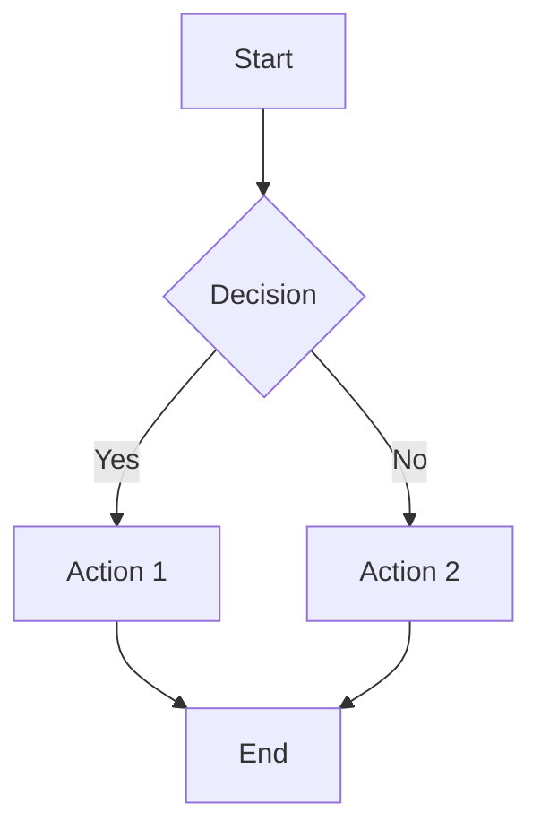
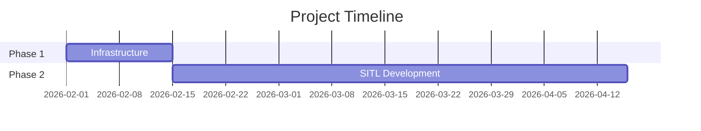
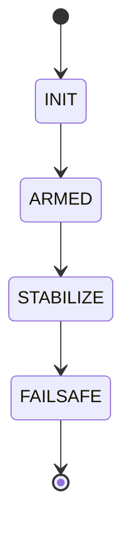
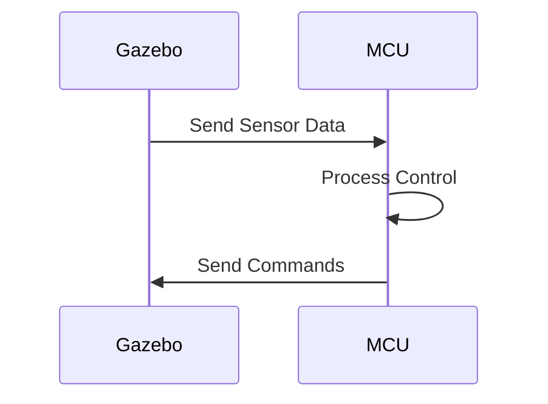

# MBSE Diagram Master Plan
## UAV Flight Controller with On-Board Reinforcement Learning

**Document Information**

| Field | Value |
|-------|-------|
| **Document Title** | MBSE Diagram Master Plan |
| **Version** | 1.0 |
| **Date** | February 8, 2026 |
| **Author** | Ratan Lal Bunkar |
| **Status** | Active - Planning Phase |
| **Purpose** | Strategic plan for all MBSE diagrams across WBS documentation |

---

## Executive Summary

This document provides a comprehensive, strategic plan for creating Model-Based Systems Engineering (MBSE) diagrams to enhance the WBS documentation. The plan identifies **32 critical diagrams** organized into 8 categories, prioritized by impact and complexity. All diagrams will use industry-standard tools (primarily Mermaid.js for version control compatibility) and follow consistent visual language.

**Diagram Categories:**
1. System Architecture (6 diagrams)
2. Process & Workflow (5 diagrams)
3. Data & Information Flow (4 diagrams)
4. Timeline & Scheduling (4 diagrams)
5. Component & Interface (5 diagrams)
6. Behavioral & State (4 diagrams)
7. Requirements & Traceability (2 diagrams)
8. Deployment & Integration (2 diagrams)

**Total Effort Estimate**: 80-100 hours of diagram creation across 3-4 weeks

---

## 1. Strategic Approach

### 1.1 Diagram Philosophy

**Model-Based Systems Engineering Principles:**
- **Hierarchical Decomposition**: Top-level context → subsystem detail → component specifics
- **Consistency**: Common notation and visual language across all diagrams
- **Traceability**: Every diagram element traces to WBS requirements
- **Version Control**: Diagrams stored as code (Mermaid.js) alongside markdown documentation
- **Living Documents**: Diagrams update as project evolves

**Target Audiences:**
- **Stakeholders**: High-level architecture and timeline diagrams
- **New Team Members**: Context diagrams, workflow, and integration views
- **Engineers**: Detailed component, interface, and data flow diagrams
- **Reviewers**: Traceability, requirements, and validation diagrams

### 1.2 Tool Selection

| Diagram Type | Primary Tool | Rationale | Export Format |
|--------------|-------------|-----------|---------------|
| System Architecture | Mermaid (flowchart/graph) | Version control, markdown integration | SVG, PNG |
| Data Flow | Mermaid (graph/flowchart) | Clear data relationships | SVG, PNG |
| Timeline/Gantt | Mermaid (gantt) | Native timeline support | SVG, PNG |
| State Machines | Mermaid (stateDiagram) | Behavioral modeling | SVG, PNG |
| Sequence Diagrams | Mermaid (sequenceDiagram) | Interaction modeling | SVG, PNG |
| Block Diagrams | Mermaid (graph) or draw.io | Flexibility for complex layouts | SVG, PNG |
| Requirements | Custom tables + Mermaid | Traceability matrices | Markdown tables |

**Primary: Mermaid.js** - All diagrams created in Mermaid.js syntax for:
- Version control friendly (text-based)
- Automatic rendering in markdown viewers
- Easy updates and maintenance
- Consistent styling

**Secondary: draw.io** - For exceptionally complex diagrams requiring custom layouts

### 1.3 Diagram Placement Strategy

Each diagram will be placed in the most relevant WBS document with cross-references:

- **Master Overview** (00): High-level architecture, project timeline, phase dependencies
- **Phase 1** (01): Infrastructure and process diagrams
- **Phase 2** (02): SITL architecture and baseline control diagrams
- **Phase 3** (03): RL architecture, training pipeline, and performance diagrams
- **Phase 4** (04): HIL architecture, firmware flow, and real-time diagrams
- **Phase 5** (05): Hardware architecture and PCB layout context
- **Phase 6** (06): Integration architecture and validation flow

**Central Diagram Repository**: Create `WBS/diagrams/` directory with:
- `/diagrams/source/` - Mermaid.js source files
- `/diagrams/rendered/` - PNG/SVG exports
- `/diagrams/README.md` - Diagram index and quick reference

---

## 2. Diagram Catalog (32 Diagrams)

### Category 1: System Architecture Diagrams (6 diagrams)

#### **D1.1 - Overall System Context Diagram** ⭐ PRIORITY 1
- **Placement**: 00_WBS_Master_Overview.md (Section 1)
- **Purpose**: Show complete system boundary and external interfaces
- **Type**: Mermaid block diagram (graph TD)
- **Complexity**: Medium
- **Effort**: 6 hours
- **Content**:
  - UAV flight controller (system boundary)
  - External actors: operator, simulation environment, sensors
  - Major subsystems: SITL, RL training, HIL, custom hardware
  - Key interfaces and data flows
- **Success Criteria**: New team members understand system scope in 5 minutes

#### **D1.2 - System Hierarchy Decomposition** ⭐ PRIORITY 1
- **Placement**: 00_WBS_Master_Overview.md (Section 2)
- **Purpose**: Visual WBS hierarchy showing all 4 levels
- **Type**: Mermaid tree diagram (graph TD with subgraphs)
- **Complexity**: High (32 work packages across 6 phases)
- **Effort**: 10 hours
- **Content**:
  - Level 1: 6 phases as top nodes
  - Level 2: Subsystems under each phase
  - Level 3: Deliverables (color-coded by status)
  - Level 4: Key tasks (expandable/collapsible)
- **Success Criteria**: Complete WBS navigable visually; matches section 2.1-2.6

#### **D1.3 - SITL System Architecture** ⭐ PRIORITY 2
- **Placement**: 02_WBS_Phase2_SITL_Baseline.md (Top of document)
- **Purpose**: Detailed architecture of software-in-the-loop system
- **Type**: Mermaid layered architecture diagram
- **Complexity**: Medium-High
- **Effort**: 8 hours
- **Content**:
  - Simulation environment (Gazebo + ROS)
  - UAV dynamics model (equations of motion, motor model, aerodynamics)
  - Sensor models (IMU, optional GPS/baro/mag)
  - Baseline PID controller (attitude, altitude, position cascade)
  - Data flow arrows showing state feedback and control commands
- **Success Criteria**: Engineers can identify all SITL components and connections

#### **D1.4 - HIL System Architecture** ⭐ PRIORITY 2
- **Placement**: 04_WBS_Phase4_HIL_Flight_Control.md (Top of document)
- **Purpose**: Architecture showing firmware integration with simulation
- **Type**: Mermaid deployment/component diagram
- **Complexity**: High
- **Effort**: 8 hours
- **Content**:
  - Gazebo simulation environment (left side)
  - MCU with firmware (center)
  - HIL interface bridge (communication layer)
  - Sensor data flow: Gazebo → HIL interface → MCU firmware
  - Control command flow: MCU firmware → HIL interface → Gazebo
  - Timing constraints annotations
- **Success Criteria**: Clear separation of simulation vs embedded components

#### **D1.5 - Custom Hardware System Architecture** ⭐ PRIORITY 3
- **Placement**: 05_WBS_Phase5_Custom_Hardware.md (Section 5.2)
- **Purpose**: Physical hardware block diagram
- **Type**: Mermaid block diagram with hierarchical modules
- **Complexity**: Medium
- **Effort**: 6 hours
- **Content**:
  - Power supply subsystem (battery → regulators → rails)
  - MCU subsystem (micro, clock, debug interface)
  - Sensor subsystem (IMU, optional sensors, interfaces)
  - Communication subsystem (UART, USB, telemetry)
  - Motor driver subsystem (PWM outputs, drivers)
  - Annotations: voltages, communication protocols, pin counts
- **Success Criteria**: Corresponds to schematic; captures all major subsystems

#### **D1.6 - End-to-End Integration Architecture** ⭐ PRIORITY 2
- **Placement**: 06_WBS_Phase6_Integration_Validation.md (Top of document)
- **Purpose**: Complete system showing SITL → HIL → Hardware progression
- **Type**: Mermaid multi-layer architecture
- **Complexity**: High
- **Effort**: 10 hours
- **Content**:
  - Three vertical swim lanes: SITL, HIL, Custom Hardware
  - Common components across all: UAV dynamics, RL policy, sensor suite
  - Evolving components: Control loop (software → firmware → embedded)
  - Validation points at each transition
  - Fidelity progression (simulation → real-time → physical)
- **Success Criteria**: Illustrates simulation-to-hardware methodology

---

### Category 2: Process & Workflow Diagrams (5 diagrams)

#### **D2.1 - Project Methodology Workflow** ⭐ PRIORITY 1
- **Placement**: 00_WBS_Master_Overview.md (Section 1.2)
- **Purpose**: Show simulation-first, hardware-last approach
- **Type**: Mermaid flowchart with decision gates
- **Complexity**: Medium
- **Effort**: 6 hours
- **Content**:
  - Sequential phases: Infrastructure → SITL → RL → HIL → Hardware → Integration
  - Stage gates between phases (diamond decision nodes)
  - Feedback loops for iteration
  - Exit criteria checks
- **Success Criteria**: Methodology clear to stakeholders; matches section 1.3

#### **D2.2 - RL Training Pipeline** ⭐ PRIORITY 1
- **Placement**: 03_WBS_Phase3_RL_Control.md (Section 3.4)
- **Purpose**: Detailed flow of RL training process
- **Type**: Mermaid flowchart with subgraphs
- **Complexity**: High
- **Effort**: 8 hours
- **Content**:
  - Environment design (observation/action/reward)
  - Policy architecture selection
  - Training loop: (sample → update → evaluate)
  - Hyperparameter tuning iterations
  - Convergence validation
  - Compression pipeline
  - Outputs: trained policy, metrics, logs
- **Success Criteria**: ML engineers can follow complete training workflow

#### **D2.3 - Stage Gate Review Process** ⭐ PRIORITY 3
- **Placement**: 01_WBS_Phase1_Infrastructure.md (Section 1.4)
- **Purpose**: Formal review procedure for phase transitions
- **Type**: Mermaid swimlane diagram
- **Complexity**: Medium
- **Effort**: 5 hours
- **Content**:
  - Swim lanes: Project Manager, Systems Engineer, Stakeholders
  - Process steps: Exit criteria check → Documentation review → Gate meeting → Decision
  - Decision branches: Go / No-Go / Go with conditions
  - Escalation paths
- **Success Criteria**: Clear governance process

#### **D2.4 - CI/CD Pipeline Architecture** ⭐ PRIORITY 3
- **Placement**: 01_WBS_Phase1_Infrastructure.md (Section 1.2)
- **Purpose**: Continuous integration and deployment workflow
- **Type**: Mermaid flowchart with parallel branches
- **Complexity**: Medium-High
- **Effort**: 6 hours
- **Content**:
  - Two parallel pipelines: Simulation code vs Firmware code
  - Simulation pipeline: Lint → Unit tests → Integration tests → SITL tests
  - Firmware pipeline: Cross-compile → Static analysis → Unit tests → HIL tests
  - Artifact generation and deployment
- **Success Criteria**: Engineers understand automated testing strategy

#### **D2.5 - Requirements Management Process** ⭐ PRIORITY 4
- **Placement**: 01_WBS_Phase1_Infrastructure.md (Section 1.1)
- **Purpose**: Requirements lifecycle from elicitation to verification
- **Type**: Mermaid state diagram or flowchart
- **Complexity**: Low-Medium
- **Effort**: 4 hours
- **Content**:
  - States: Draft → Reviewed → Approved → Implemented → Verified
  - Transitions and approval gates
  - Change request process
- **Success Criteria**: Requirements process is transparent

---

### Category 3: Data & Information Flow Diagrams (4 diagrams)

#### **D3.1 - SITL Data Flow Diagram** ⭐ PRIORITY 2
- **Placement**: 02_WBS_Phase2_SITL_Baseline.md (Section 2.5)
- **Purpose**: Complete data flow through SITL system
- **Type**: Mermaid graph with typed edges
- **Complexity**: Medium
- **Effort**: 6 hours
- **Content**:
  - Data sources: UAV dynamics model states
  - Sensor models (transformations and noise injection)
  - Controller inputs (observations)
  - Controller outputs (control commands)
  - Actuator models (motor dynamics)
  - Physics integration (state updates)
  - Data types labeled on arrows (position, velocity, attitude, thrust, etc.)
- **Success Criteria**: Engineers trace data from dynamics through control loop

#### **D3.2 - HIL Communication Flow** ⭐ PRIORITY 2
- **Placement**: 04_WBS_Phase4_HIL_Flight_Control.md (Section 4.4)
- **Purpose**: Bidirectional data exchange between Gazebo and MCU firmware
- **Type**: Mermaid sequence diagram
- **Complexity**: Medium-High
- **Effort**: 7 hours
- **Content**:
  - Actors: Gazebo Plugin, UART/USB Interface, MCU Firmware
  - Initialization sequence
  - Periodic sensor data transmission (Gazebo → Firmware)
  - Control command transmission (Firmware → Gazebo)
  - Timing annotations (frequencies, latencies)
  - Error handling and timeout scenarios
- **Success Criteria**: Firmware engineers understand communication protocol

#### **D3.3 - RL Policy Data Flow** ⭐ PRIORITY 2
- **Placement**: 03_WBS_Phase3_RL_Control.md (Section 3.2)
- **Purpose**: Data transformation through RL policy pipeline
- **Type**: Mermaid flowchart with data annotations
- **Complexity**: Medium
- **Effort**: 5 hours
- **Content**:
  - Raw sensor data inputs
  - Observation space composition (position, velocity, attitude, rates)
  - Normalization transformations
  - Neural network forward pass (layer by layer)
  - Action space output
  - De-normalization to control commands
  - Dimensionality and ranges labeled at each step
- **Success Criteria**: Clear how raw sensors become control commands

#### **D3.4 - Control Loop Cascade Architecture** ⭐ PRIORITY 3
- **Placement**: 02_WBS_Phase2_SITL_Baseline.md (Section 2.4)
- **Purpose**: Detailed PID cascade control structure
- **Type**: Block diagram (Mermaid or traditional)
- **Complexity**: Medium
- **Effort**: 6 hours
- **Content**:
  - Outer loop: Position controller (X, Y, Z setpoints → velocity commands)
  - Middle loop: Velocity/Altitude controller (velocity setpoints → attitude commands)
  - Inner loop: Attitude controller (attitude setpoints → motor thrust commands)
  - Feedback paths from state estimator
  - Control gains annotated (Kp, Ki, Kd)
  - Saturation blocks
- **Success Criteria**: Controls engineers understand cascade structure

---

### Category 4: Timeline & Scheduling Diagrams (4 diagrams)

#### **D4.1 - Master Project Gantt Chart** ⭐ PRIORITY 1
- **Placement**: 00_WBS_Master_Overview.md (Section 4)
- **Purpose**: Complete project timeline showing all phases
- **Type**: Mermaid Gantt chart
- **Complexity**: High
- **Effort**: 8 hours
- **Content**:
  - All 6 phases with start/end dates
  - Major milestones (stage gates)
  - Dependencies between phases
  - Critical path highlighted
  - Resource loading indicators (optional)
  - Today marker showing current progress
- **Success Criteria**: Stakeholders understand timeline at a glance

#### **D4.2 - Phase 2 (SITL) Detailed Schedule** ⭐ PRIORITY 3
- **Placement**: 02_WBS_Phase2_SITL_Baseline.md (Phase Overview)
- **Purpose**: Detailed timeline for SITL development
- **Type**: Mermaid Gantt chart
- **Complexity**: Medium
- **Effort**: 5 hours
- **Content**:
  - Level 2 subsystems as task groups
  - Level 3 deliverables as individual tasks
  - Parallel work opportunities highlighted
  - 8-10 week span with weekly resolution
- **Success Criteria**: Project manager can assign and track tasks

#### **D4.3 - Phase 3 (RL) Detailed Schedule** ⭐ PRIORITY 3
- **Placement**: 03_WBS_Phase3_RL_Control.md (Phase Overview)
- **Purpose**: Detailed timeline for RL training with uncertainty
- **Type**: Mermaid Gantt chart with uncertainty bars
- **Complexity**: Medium
- **Effort**: 5 hours
- **Content**:
  - Training iterations shown with variable durations
  - Human effort vs compute time distinguished (different bar styles)
  - Hyperparameter tuning cycles
  - Evaluation and compression milestones
  - 10-12 week span
- **Success Criteria**: Accounts for RL training variability

#### **D4.4 - Phase Dependencies Network** ⭐ PRIORITY 2
- **Placement**: 00_WBS_Master_Overview.md (Section 2)
- **Purpose**: Dependency relationships between all subsystems
- **Type**: Mermaid graph (DAG - Directed Acyclic Graph)
- **Complexity**: High
- **Effort**: 7 hours
- **Content**:
  - Nodes: All Level 2 subsystems (1.1, 1.2, ... 6.3)
  - Edges: Dependencies (must complete before)
  - Critical path highlighted in bold/color
  - Parallel work opportunities in same vertical alignment
  - Annotations: Deliverable handoffs
- **Success Criteria**: Engineers see parallelization opportunities

---

### Category 5: Component & Interface Diagrams (5 diagrams)

#### **D5.1 - Software Component Architecture** ⭐ PRIORITY 2
- **Placement**: 02_WBS_Phase2_SITL_Baseline.md (Section 2.2)
- **Purpose**: Software modules and their interfaces (SITL)
- **Type**: Mermaid component diagram (C4 model style)
- **Complexity**: Medium-High
- **Effort**: 7 hours
- **Content**:
  - Components: UAV Dynamics, Sensor Models, Controller, Simulation Manager
  - Interfaces: Function calls, ROS topics/services, shared memory
  - Data contracts (message types, frequencies)
  - External dependencies: Gazebo, ROS, RL framework
- **Success Criteria**: Software architecture clearly defined for implementation

#### **D5.2 - Firmware Module Architecture** ⭐ PRIORITY 2
- **Placement**: 04_WBS_Phase4_HIL_Flight_Control.md (Section 4.2)
- **Purpose**: Firmware modules and real-time structure
- **Type**: Mermaid component diagram with timing
- **Complexity**: Medium-High
- **Effort**: 7 hours
- **Content**:
  - RTOS tasks: Sensor Task, Control Task, Communication Task, Safety Task
  - Task priorities and frequencies
  - Inter-task communication: queues, semaphores, shared data
  - Interrupt service routines
  - Memory partitioning (stack, heap, static)
- **Success Criteria**: Embedded engineers can implement firmware architecture

#### **D5.3 - ROS Node and Topic Graph** ⭐ PRIORITY 3
- **Placement**: 02_WBS_Phase2_SITL_Baseline.md (Section 2.1)
- **Purpose**: ROS computational graph for SITL
- **Type**: Mermaid graph (nodes and topics)
- **Complexity**: Medium
- **Effort**: 5 hours
- **Content**:
  - ROS nodes: Gazebo, SITL UAV node, Controller node, Sensor nodes
  - Topics: /imu/data, /cmd_vel, /odometry, /joint_states, etc.
  - Topic types and frequencies
  - Services for configuration
- **Success Criteria**: ROS dependencies and data flow clear

#### **D5.4 - Hardware Interface Specifications** ⭐ PRIORITY 3
- **Placement**: 05_WBS_Phase5_Custom_Hardware.md (Section 5.1)
- **Purpose**: Physical and logical interfaces on custom PCB
- **Type**: Table + Mermaid diagram
- **Complexity**: Medium
- **Effort**: 6 hours
- **Content**:
  - Power interfaces (battery input, regulated outputs)
  - Sensor interfaces (I2C, SPI, pin assignments)
  - Motor outputs (PWM signals, pinout)
  - Communication interfaces (UART, USB, debug)
  - Pin mapping table
  - Electrical specifications (voltages, currents, frequencies)
- **Success Criteria**: Sufficient detail for schematic design and firmware development

#### **D5.5 - Neural Network Architecture Diagram** ⭐ PRIORITY 2
- **Placement**: 03_WBS_Phase3_RL_Control.md (Section 3.3)
- **Purpose**: Visual representation of policy network structure
- **Type**: Custom diagram (layered architecture)
- **Complexity**: Low-Medium
- **Effort**: 4 hours
- **Content**:
  - Input layer (observation space dimensions)
  - Hidden layers (units, activations)
  - Output layer (action space dimensions)
  - Value function branch (if applicable for PPO)
  - Parameter counts per layer
  - Total network size
- **Success Criteria**: ML engineers can reproduce network architecture

---

### Category 6: Behavioral & State Diagrams (4 diagrams)

#### **D6.1 - Flight Controller State Machine** ⭐ PRIORITY 2
- **Placement**: 04_WBS_Phase4_HIL_Flight_Control.md (Section 4.6)
- **Purpose**: Firmware operational states and transitions
- **Type**: Mermaid state diagram
- **Complexity**: Medium
- **Effort**: 6 hours
- **Content**:
  - States: INIT, ARMED, STABILIZE, AUTONOMOUS, FAILSAFE, ERROR
  - Transitions: Conditions for state changes
  - Actions on entry/exit for each state
  - Safety transitions to FAILSAFE
  - Recovery paths from ERROR
- **Success Criteria**: State machine guides firmware implementation

#### **D6.2 - RL Training State Machine** ⭐ PRIORITY 3
- **Placement**: 03_WBS_Phase3_RL_Control.md (Section 3.4)
- **Purpose**: Training process states and iteration logic
- **Type**: Mermaid state diagram
- **Complexity**: Medium
- **Effort**: 5 hours
- **Content**:
  - States: SETUP, TRAINING, EVALUATION, TUNING, CONVERGED, FAILED
  - Episode lifecycle: RESET → RUN → TERMINAL
  - Convergence detection logic
  - Hyperparameter adjustment triggers
- **Success Criteria**: Training workflow is clear

#### **D6.3 - Stage Gate Transition State Diagram** ⭐ PRIORITY 3
- **Placement**: 01_WBS_Phase1_Infrastructure.md (Section 1.4)
- **Purpose**: Stage gate approval process states
- **Type**: Mermaid state diagram
- **Complexity**: Low-Medium
- **Effort**: 4 hours
- **Content**:
  - States: IN_PROGRESS, READY_FOR_REVIEW, UNDER_REVIEW, APPROVED, REJECTED, CONDITIONAL
  - Transitions based on criteria verification
  - Escalation paths
- **Success Criteria**: Governance process formalized

#### **D6.4 - HIL Simulation Sequence Diagram** ⭐ PRIORITY 3
- **Placement**: 04_WBS_Phase4_HIL_Flight_Control.md (Section 4.4)
- **Purpose**: Time-sequenced interactions in HIL loop
- **Type**: Mermaid sequence diagram
- **Complexity**: Medium
- **Effort**: 5 hours
- **Content**:
  - Actors: Gazebo, HIL Bridge, MCU Firmware
  - Initialization handshake
  - Synchronous control loop cycles
  - Asynchronous events (sensor updates, timeouts)
  - Timing constraints annotations
- **Success Criteria**: Real-time behavior is clear

---

### Category 7: Requirements & Traceability Diagrams (2 diagrams)

#### **D7.1 - Requirements Decomposition Tree** ⭐ PRIORITY 3
- **Placement**: 01_WBS_Phase1_Infrastructure.md (Section 1.1)
- **Purpose**: Hierarchical breakdown of all requirements
- **Type**: Mermaid tree diagram (graph TD)
- **Complexity**: High
- **Effort**: 8 hours
- **Content**:
  - Top level: System requirements
  - Level 2: Subsystem requirements (SITL, RL, HIL, Hardware)
  - Level 3: Component requirements
  - Level 4: Detailed technical requirements
  - Color coding by requirement type (functional, performance, interface, constraint)
  - Requirement IDs as node labels
- **Success Criteria**: Complete requirements hierarchy visualized

#### **D7.2 - Traceability Matrix Visualization** ⭐ PRIORITY 4
- **Placement**: 01_WBS_Phase1_Infrastructure.md (Section 1.1)
- **Purpose**: Visual representation of requirement → design → test traceability
- **Type**: Mermaid graph with three layers
- **Complexity**: High
- **Effort**: 10 hours
- **Content**:
  - Left side: Requirements (nodes)
  - Middle: Design elements/WBS work packages (nodes)
  - Right side: Test cases (nodes)
  - Edges: Traceability links
  - Highlight orphaned requirements or untested designs
- **Success Criteria**: Traceability gaps identified visually

---

### Category 8: Deployment & Integration Diagrams (2 diagrams)

#### **D8.1 - SITL Deployment Diagram** ⭐ PRIORITY 4
- **Placement**: 02_WBS_Phase2_SITL_Baseline.md (Section 2.1)
- **Purpose**: Physical/logical deployment of SITL components
- **Type**: Mermaid deployment diagram
- **Complexity**: Low-Medium
- **Effort**: 4 hours
- **Content**:
  - Hardware: Development workstation
  - OS: Ubuntu 20.04/22.04
  - Containers/VMs if used
  - Installed software: ROS, Gazebo, Python environment
  - Network configuration
- **Success Criteria**: Setup instructions clear

#### **D8.2 - HIL Physical Setup Diagram** ⭐ PRIORITY 3
- **Placement**: 04_WBS_Phase4_HIL_Flight_Control.md (Section 4.4)
- **Purpose**: Physical connections between computer and MCU
- **Type**: Diagram showing physical components and cables
- **Complexity**: Low-Medium
- **Effort**: 4 hours
- **Content**:
  - Development workstation
  - MCU development board
  - Debugger/programmer
  - USB/UART cables
  - Power supply
  - Connections labeled with protocols and voltages
- **Success Criteria**: Lab setup reproducible from diagram

---

## 3. Implementation Plan

### 3.1 Prioritization Framework

**Priority 1** (8 diagrams - ~60 hours): High impact, foundational diagrams needed ASAP
- D1.1 Overall System Context
- D1.2 System Hierarchy Decomposition
- D2.1 Project Methodology Workflow
- D2.2 RL Training Pipeline
- D3.1 SITL Data Flow
- D4.1 Master Project Gantt Chart

**Priority 2** (10 diagrams - ~72 hours): Support detailed engineering work
- D1.3, D1.4, D1.6 (SITL, HIL, Integration architectures)
- D3.2, D3.3 (HIL communication, RL data flow)
- D4.4 (Phase dependencies)
- D5.1, D5.2, D5.5 (Component architectures)
- D6.1 (Flight controller state machine)

**Priority 3** (11 diagrams - ~62 hours): Enhance documentation quality
- D1.5 (Custom hardware architecture)
- D2.3, D2.4 (Stage gate, CI/CD)
- D3.4 (Control loop cascade)
- D4.2, D4.3 (SITL/RL schedules)
- D5.3, D5.4 (ROS graph, hardware interfaces)
- D6.2, D6.3, D6.4 (State machines and sequences)
- D7.1 (Requirements tree)
- D8.2 (HIL setup)

**Priority 4** (3 diagrams - ~18 hours): Nice to have, lower priority
- D2.5 (Requirements process)
- D7.2 (Traceability matrix)
- D8.1 (SITL deployment)

### 3.2 Phased Implementation Schedule

**Week 1: Foundation Diagrams (Priority 1 core)**
- Day 1-2: D1.1 Overall System Context (6h)
- Day 2-3: D1.2 System Hierarchy Decomposition (10h)
- Day 4-5: D2.1 Project Methodology Workflow (6h)
- **Deliverable**: Master Overview enhanced with 3 key diagrams

**Week 2: System Architecture (Priority 1 + 2)**
- Day 1-2: D1.3 SITL Architecture (8h)
- Day 3-4: D1.4 HIL Architecture (8h)
- Day 5: D1.6 End-to-End Integration (10h)
- **Deliverable**: Phase 2, 4, 6 documents with architecture diagrams

**Week 3: Process & Data Flow (Priority 1 + 2)**
- Day 1-2: D2.2 RL Training Pipeline (8h)
- Day 3: D3.1 SITL Data Flow (6h)
- Day 4: D3.2 HIL Communication Flow (7h)
- Day 5: D3.3 RL Policy Data Flow (5h)
- **Deliverable**: Phase 2, 3, 4 with data flow clarity

**Week 4: Timeline & Components (Priority 1 + 2)**
- Day 1-2: D4.1 Master Gantt Chart (8h)
- Day 3: D4.4 Phase Dependencies (7h)
- Day 4: D5.1 Software Components (7h)
- Day 5: D5.2 Firmware Modules (7h)
- **Deliverable**: Timeline clarity and component specifications complete

**Week 5+: Enhancement Diagrams (Priority 3 + 4)**
- Remaining diagrams as time permits
- Diagram refinement based on feedback
- Update diagrams as project progresses

### 3.3 Resource Requirements

**Personnel**:
- **Lead Systems Engineer** (diagram architect): 50% allocation, 4 weeks = 80 hours
- **Subject Matter Experts** (review and input): 5-10 hours each
  - Controls engineer (for D2.4, D3.4)
  - ML engineer (for D2.2, D3.3, D5.5)
  - Embedded engineer (for D5.2, D6.1)
  - Hardware engineer (for D1.5, D5.4)

**Tools & Software**:
- Mermaid Live Editor (free): https://mermaid.live
- VS Code with Mermaid extension (free)
- draw.io desktop (free) - backup tool
- Image export tools (built into Mermaid)

**Infrastructure**:
- Git repository for diagram source files
- CI/CD to auto-render diagrams on commit (optional enhancement)
- Documentation hosting with diagram support

### 3.4 Quality Assurance

**Diagram Quality Checklist**:
- [ ] Follows MBSE best practices
- [ ] Uses consistent notation across similar diagram types
- [ ] All elements labeled clearly
- [ ] Legend/key provided where necessary
- [ ] Appropriate level of detail for target audience
- [ ] Traces to WBS requirements
- [ ] Technically accurate (SME reviewed)
- [ ] Renders correctly in all target formats (GitHub, PDF, print)
- [ ] Source file version controlled
- [ ] Referenced correctly in markdown documents

**Review Process**:
1. **Draft Review** (Internal): Systems engineer self-review against checklist
2. **Technical Review** (SME): Subject matter expert validates technical accuracy
3. **Stakeholder Review**: Confirm diagram meets communication needs
4. **Final Approval**: Integrate into documentation

---

## 4. Diagram Directory Structure

```
WBS/
├── diagrams/
│   ├── README.md                          # Diagram index and quick reference
│   ├── source/                            # Mermaid.js source files
│   │   ├── architecture/
│   │   │   ├── D1.1_system_context.mmd
│   │   │   ├── D1.2_system_hierarchy.mmd
│   │   │   ├── D1.3_sitl_architecture.mmd
│   │   │   ├── D1.4_hil_architecture.mmd
│   │   │   ├── D1.5_hardware_architecture.mmd
│   │   │   └── D1.6_integration_architecture.mmd
│   │   ├── process/
│   │   │   ├── D2.1_methodology_workflow.mmd
│   │   │   ├── D2.2_rl_training_pipeline.mmd
│   │   │   ├── D2.3_stage_gate_process.mmd
│   │   │   ├── D2.4_cicd_pipeline.mmd
│   │   │   └── D2.5_requirements_process.mmd
│   │   ├── dataflow/
│   │   │   ├── D3.1_sitl_dataflow.mmd
│   │   │   ├── D3.2_hil_communication.mmd
│   │   │   ├── D3.3_rl_policy_dataflow.mmd
│   │   │   └── D3.4_control_cascade.mmd
│   │   ├── timeline/
│   │   │   ├── D4.1_master_gantt.mmd
│   │   │   ├── D4.2_sitl_schedule.mmd
│   │   │   ├── D4.3_rl_schedule.mmd
│   │   │   └── D4.4_phase_dependencies.mmd
│   │   ├── components/
│   │   │   ├── D5.1_software_components.mmd
│   │   │   ├── D5.2_firmware_modules.mmd
│   │   │   ├── D5.3_ros_graph.mmd
│   │   │   ├── D5.4_hardware_interfaces.mmd
│   │   │   └── D5.5_neural_network.mmd
│   │   ├── behavioral/
│   │   │   ├── D6.1_controller_state_machine.mmd
│   │   │   ├── D6.2_training_state_machine.mmd
│   │   │   ├── D6.3_stagegate_states.mmd
│   │   │   └── D6.4_hil_sequence.mmd
│   │   ├── requirements/
│   │   │   ├── D7.1_requirements_tree.mmd
│   │   │   └── D7.2_traceability_matrix.mmd
│   │   └── deployment/
│   │       ├── D8.1_sitl_deployment.mmd
│   │       └── D8.2_hil_physical_setup.mmd
│   │
│   └── rendered/                          # Auto-generated PNG/SVG exports
│       ├── architecture/
│       ├── process/
│       ├── dataflow/
│       ├── timeline/
│       ├── components/
│       ├── behavioral/
│       ├── requirements/
│       └── deployment/
```

---

## 5. Maintenance and Evolution

### 5.1 Living Documentation

Diagrams are **living documents** that evolve with the project:

- **Phase Entry**: Update relevant diagrams with detailed design decisions
- **Phase Exit**: Validate diagrams reflect as-built system
- **Weekly Reviews**: Check if any diagrams need updates based on changes
- **Version Control**: All diagram sources committed with meaningful messages

### 5.2 Change Management

**When to Update Diagrams**:
- Requirements change
- Architecture decisions made or revised
- New components added or removed
- Interface definitions change
- Schedule adjustments
- Lessons learned during implementation

**Update Process**:
1. Identify affected diagrams
2. Update source `.mmd` files
3. Regenerate rendered images
4. Update references in markdown documents
5. Commit with clear change description
6. Notify team of significant diagram changes

### 5.3 Feedback Loop

- Collect feedback after each stage gate review
- Survey team on diagram usefulness
- Identify missing diagrams or unclear elements
- Refine visual style based on stakeholder preferences

---

## 6. Success Metrics

**Quantitative Metrics**:
- [ ] All 32 planned diagrams created and integrated
- [ ] 100% of WBS documents have at least 2 diagrams
- [ ] Diagram source files under version control
- [ ] <5 minute update time for any single diagram
- [ ] Zero broken diagram references in documents

**Qualitative Metrics**:
- [ ] New team members onboard faster using diagrams
- [ ] Stakeholders report improved project understanding
- [ ] Technical reviews reference diagrams for discussions
- [ ] Fewer clarification questions on system architecture
- [ ] Gate reviews run more efficiently with visual aids

**Adoption Indicators**:
- Team members voluntarily reference diagrams in discussions
- Diagrams used in presentations to external parties
- Other projects request to reuse diagram templates
- Diagrams cited in design decision documents

---

## 7. Risk Mitigation

| Risk | Impact | Probability | Mitigation |
|------|--------|-------------|------------|
| Diagram creation delays project work | High | Medium | Dedicate resource, parallelize with implementation |
| Diagrams become outdated quickly | High | High | Automate rendering, schedule regular reviews |
| Tool limitations (Mermaid too simple) | Medium | Low | Use draw.io for complex diagrams, keep source in repo |
| Team doesn't use/update diagrams | High | Medium | Integrate into review processes, demonstrate value early |
| Excessive detail obscures clarity | Medium | Medium | Multiple abstraction levels, hide complexity in expandable sections |

---

## 8. Next Steps

### Immediate Actions (This Week):
1. ✅ Review and approve this Diagram Master Plan
2. Create `WBS/diagrams/` directory structure
3. Set up Mermaid.js development environment
4. Begin Priority 1 diagrams (D1.1, D1.2, D2.1)

### Short Term (Weeks 1-4):
1. Implement all Priority 1 diagrams
2. Integrate diagrams into Master Overview and Phase documents
3. Conduct first round of SME reviews
4. Begin Priority 2 diagrams

### Long Term (Month 2+):
1. Complete Priority 2 and 3 diagrams
2. Establish diagram update cadence with phase progress
3. Collect feedback and refine diagram style
4. Create diagram templates for reuse

---

## Appendix A: Mermaid.js Quick Reference

### Common Diagram Types for This Project

**Flowchart/Block Diagram**:


**Gantt Chart**:


**State Diagram**:


**Sequence Diagram**:


### Style Guidelines

- Use subgraphs for logical grouping
- Apply consistent colors: 
  - Blue for software components
  - Green for hardware components
  - Orange for data flows
  - Red for error/safety paths
- Label all edges with data types or conditions
- Keep diagram width <1000px for readability

---

## Appendix B: Diagram Templates

Templates will be created for:
- System architecture (layered view)
- Data flow (typed connections)
- Process workflow (swimlanes optional)
- Component interface (ports and connections)
- State machine (standard notation)

---

## Document History

| Version | Date | Author | Changes |
|---------|------|--------|---------|
| 1.0 | 2026-02-08 | Ratan Lal Bunkar | Initial diagram master plan |

---

**END OF DIAGRAM MASTER PLAN**
