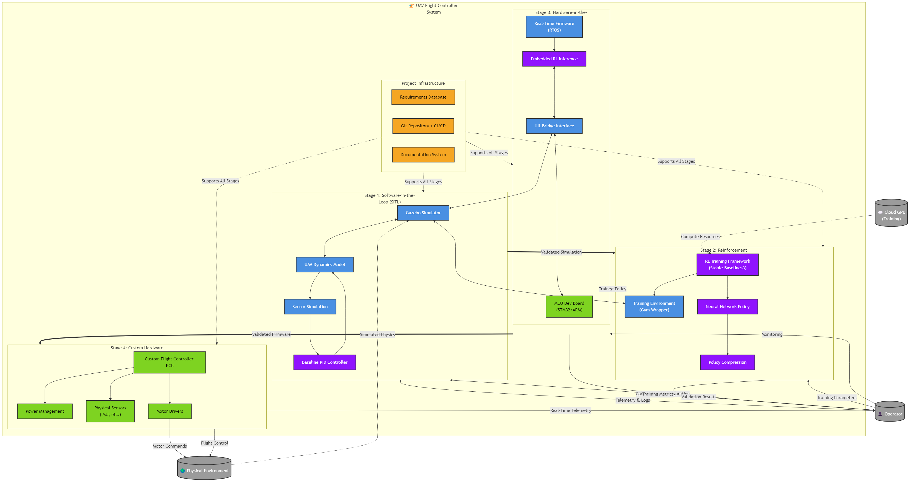
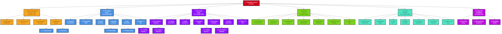
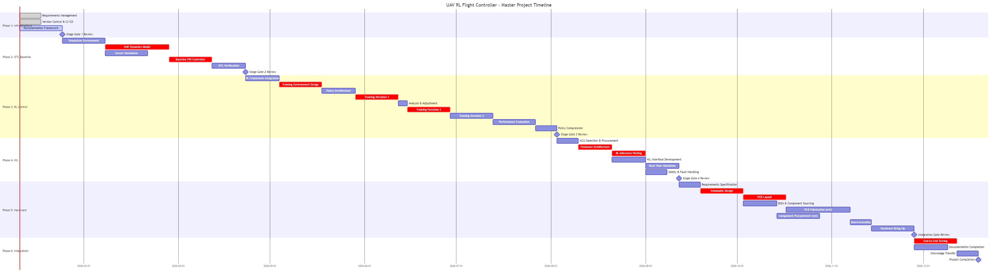
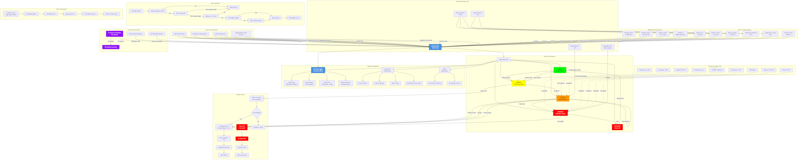
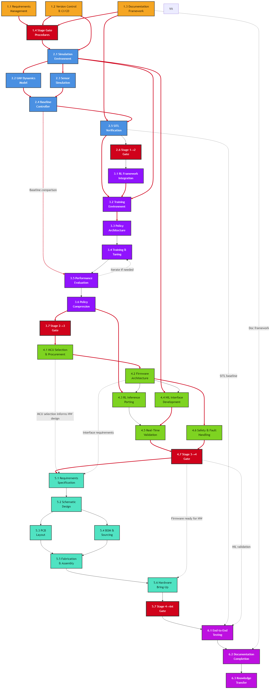

# Work Breakdown Structure - Master Overview
## UAV Flight Controller with On-Board Reinforcement Learning

---

**Document Information**

| Field | Value |
|-------|-------|
| **Document Title** | Work Breakdown Structure - Master Overview |
| **Version** | 2.0 |
| **Date** | February 8, 2026 |
| **Author** | Ratan Lal Bunkar |
| **Status** | Active |
| **Document Type** | Master Planning Reference |

---

## 1. Executive Summary

### 1.1 Project Overview

The UAV Flight Controller with On-Board Reinforcement Learning project represents an innovative approach to autonomous flight control system development that combines classical control theory, modern machine learning techniques, and embedded systems engineering. This project develops an intelligent flight control system capable of executing complex maneuvers through reinforcement learning while meeting the stringent real-time, resource-constrained requirements of embedded UAV platforms.

The project adopts a simulation-first, hardware-last methodology that systematically reduces risk while building complexity incrementally. Beginning with pure software-in-the-loop (SITL) simulation using classical control baselines, the project progresses through reinforcement learning policy development, hardware-in-the-loop (HIL) validation with embedded systems, and culminates in custom flight controller hardware integration. This staged approach ensures each subsystem is thoroughly validated before integration, minimizing costly hardware iterations and enabling rapid prototyping of control algorithms in safe, repeatable simulation environments.

#### Figure 1.1: Overall System Context



*Figure 1.1 illustrates the four-stage system progression from pure simulation (SITL) through RL policy development, hardware-in-the-loop validation, and finally custom hardware integration. Each stage builds upon the previous, systematically reducing risk while increasing system complexity and fidelity.

This system treats the UAV as a system-of-systems comprising four distinct subsystems: a high-fidelity physics simulation environment, a reinforcement learning training and inference pipeline, embedded real-time firmware, and custom flight controller hardware. Each subsystem presents unique engineering challenges spanning physics modeling, deep learning optimization, real-time embedded programming, and PCB design. The integration of these subsystems creates a cohesive intelligent flight control platform capable of adaptive control strategies learned through interaction with simulation environments and deployable on resource-constrained flight hardware.

### 1.2 WBS Purpose and Usage

This Work Breakdown Structure (WBS) serves as the definitive decomposition of all project work into manageable, assignable work packages. It provides:

- **Hierarchical decomposition** of project scope from high-level phases down to specific technical tasks
- **Clear accountability** through explicit work package ownership and deliverables
- **Schedule foundation** via task dependencies, durations, and effort estimates
- **Resource planning basis** through skill requirements and resource allocation guidance
- **Risk identification framework** by documenting technical challenges and mitigation strategies
- **Progress tracking mechanism** via measurable success criteria for each work package

Project teams should use this WBS as the authoritative reference for scope, scheduling, resource allocation, and progress reporting. Each work package is sufficiently detailed to enable assignment to individual engineers with clear deliverables and completion criteria.

### 1.3 WBS Methodology

This WBS follows a hierarchical decomposition methodology based on systems engineering principles:

**Level 1 - Project Phases**: The highest level organizes work into six major phases representing distinct project stages or cross-cutting concerns (e.g., project management infrastructure, Stage 1 SITL development, Stage 2 RL control development).

**Level 2 - System Elements**: Within each phase, work is decomposed into logical subsystems or functional areas (e.g., simulation environment, UAV dynamics model, baseline controller). These represent major components or capabilities that must be developed.

**Level 3 - Deliverables**: Each system element is further broken down into specific deliverables—tangible outputs such as software modules, documentation, test reports, or hardware components. These represent concrete artifacts that can be reviewed and verified.

**Level 4 - Tasks**: At the most granular level, deliverables are decomposed into specific technical activities required to produce them. These tasks include time estimates, resource requirements, and detailed descriptions sufficient for assignment and execution.

The 100% Rule applies: all work packages at each level completely represent the scope of their parent work package, with no gaps or overlaps. Work not explicitly included in this WBS is out of scope.

#### Figure 1.2: WBS System Hierarchy



**Figure 1.2** provides the complete system hierarchy decomposition across all six project phases, showing the four-level WBS structure with color-coded phases for visual navigation. This diagram serves as a visual index to the entire project scope.

### 1.4 Document Organization

This WBS documentation is organized into **7 strategically structured documents**:

**00_WBS_Master_Overview.md** (This Document) - High-level planning reference containing executive summary, complete WBS hierarchy, visual trees, timeline & resource analysis, and usage guidelines. Use this for project planning, stakeholder communication, and navigation to detailed execution guides.

**Phase Detail Documents** (6 documents) - Each phase has a dedicated document containing complete Level 2-4 work package descriptions for execution:
- **01_WBS_Phase1_Infrastructure.md** - Project management setup, requirements, CI/CD, documentation framework
- **02_WBS_Phase2_SITL_Baseline.md** - Simulation environment, UAV dynamics, sensor models, baseline PID controller
- **03_WBS_Phase3_RL_Control.md** - RL framework integration, training environment, policy development, evaluation
- **04_WBS_Phase4_HIL_Flight_Control.md** - MCU firmware, RL inference porting, HIL interface, real-time validation
- **05_WBS_Phase5_Custom_Hardware.md** - PCB design, schematic, fabrication, assembly, hardware bring-up
- **06_WBS_Phase6_Integration_Validation.md** - End-to-end testing, final documentation, knowledge transfer

**Readers seeking a high-level understanding should review this Master Overview.** Engineers assigned to specific work packages should consult the relevant phase detail document. Project managers should reference this overview for timeline/resource planning and phase documents for task assignment.

### 1.5 Navigation to Detail Documents

This master overview provides strategic planning information. For detailed execution guidance, refer to the phase-specific documents:

| Phase | File | Scope | Duration | Effort |
|-------|------|-------|----------|--------|
| **Phase 1** | [01_WBS_Phase1_Infrastructure.md](./01_WBS_Phase1_Infrastructure.md) | Requirements, CI/CD, Documentation, Stage Gates | 2 weeks | 120 hrs |
| **Phase 2** | [02_WBS_Phase2_SITL_Baseline.md](./02_WBS_Phase2_SITL_Baseline.md) | Gazebo Simulation, UAV Dynamics, PID Controller, Verification | 8-10 weeks | 280 hrs |
| **Phase 3** | [03_WBS_Phase3_RL_Control.md](./03_WBS_Phase3_RL_Control.md) | RL Framework, Training Environment, Policy Training, Compression | 10-12 weeks | 320 hrs |
| **Phase 4** | [04_WBS_Phase4_HIL_Flight_Control.md](./04_WBS_Phase4_HIL_Flight_Control.md) | MCU Firmware, HIL Interface, Real-Time Validation, Safety | 6-8 weeks | 240 hrs |
| **Phase 5** | [05_WBS_Phase5_Custom_Hardware.md](./05_WBS_Phase5_Custom_Hardware.md) | PCB Design, Fabrication, Assembly, Hardware Bring-Up | 10-14 weeks | 200 hrs |
| **Phase 6** | [06_WBS_Phase6_Integration_Validation.md](./06_WBS_Phase6_Integration_Validation.md) | End-to-End Testing, Final Documentation, Knowledge Transfer | 3-4 weeks | 80 hrs |

**Quick Navigation by WBS ID:**
- **1.x work packages** → See [Phase 1 Infrastructure](./01_WBS_Phase1_Infrastructure.md)
- **2.x work packages** → See [Phase 2 SITL Baseline](./02_WBS_Phase2_SITL_Baseline.md)
- **3.x work packages** → See [Phase 3 RL Control](./03_WBS_Phase3_RL_Control.md)
- **4.x work packages** → See [Phase 4 HIL Flight Control](./04_WBS_Phase4_HIL_Flight_Control.md)
- **5.x work packages** → See [Phase 5 Custom Hardware](./05_WBS_Phase5_Custom_Hardware.md)
- **6.x work packages** → See [Phase 6 Integration & Validation](./06_WBS_Phase6_Integration_Validation.md)

#### Figure 1.3: Project Methodology Workflow


**Figure 1.3** shows the six-phase project methodology with defined stage gates between each phase. Each gate includes entry/exit criteria, documentation reviews, and go/no-go decision points ensuring controlled progression through the project lifecycle.

---

## 2. WBS Hierarchy Definition

### 2.1 Four-Level WBS Structure

**1.0 PROJECT MANAGEMENT & INFRASTRUCTURE**
- 1.1 Requirements Management
  - 1.1.1 Requirements Elicitation
  - 1.1.2 Requirements Documentation
  - 1.1.3 Requirements Traceability Matrix
  - 1.1.4 Requirements Review Process
- 1.2 Version Control & CI/CD Setup
  - 1.2.1 Repository Structure
  - 1.2.2 Branching Strategy
  - 1.2.3 CI/CD Pipeline for Simulation
  - 1.2.4 CI/CD Pipeline for Firmware
- 1.3 Documentation Framework
  - 1.3.1 Documentation Templates
  - 1.3.2 Documentation Repository
  - 1.3.3 Documentation Review Process
- 1.4 Stage Gate Reviews
  - 1.4.1 Stage Gate Criteria Definition
  - 1.4.2 Review Schedule
  - 1.4.3 Stakeholder Identification
  - 1.4.4 Review Procedures

**2.0 STAGE 1: SITL BASELINE SYSTEM**
- 2.1 Simulation Environment
  - 2.1.1 Gazebo Installation & Configuration
  - 2.1.2 ROS/ROS2 Setup
  - 2.1.3 Simulation World Design
  - 2.1.4 Physics Parameter Tuning
- 2.2 UAV Dynamics Model
  - 2.2.1 Quadrotor Equations of Motion
  - 2.2.2 Motor and Propeller Modeling
  - 2.2.3 Aerodynamic Effects
  - 2.2.4 Mass and Inertia Properties
- 2.3 Sensor Simulation
  - 2.3.1 IMU Sensor Model
  - 2.3.2 Sensor Noise Characteristics
  - 2.3.3 Sensor Placement Configuration
  - 2.3.4 Optional Sensors Integration
- 2.4 Baseline Controller
  - 2.4.1 PID Attitude Controller
  - 2.4.2 Altitude Controller
  - 2.4.3 Position Controller
  - 2.4.4 Controller Parameter Tuning
- 2.5 SITL Verification
  - 2.5.1 Test Scenario Creation
  - 2.5.2 Baseline Performance Testing
  - 2.5.3 Disturbance Rejection Tests
  - 2.5.4 Verification Report
- 2.6 Stage 1→2 Gate
  - 2.6.1 Stage 1 Exit Criteria Verification
  - 2.6.2 Stage 2 Entry Criteria Validation
  - 2.6.3 Documentation Review
  - 2.6.4 Go/No-Go Decision

**3.0 STAGE 2: RL CONTROL SYSTEM**
- 3.1 RL Framework Integration
  - 3.1.1 Framework Selection
  - 3.1.2 Installation and Setup
  - 3.1.3 Gym Environment Wrapper
  - 3.1.4 Framework Validation
- 3.2 Training Environment Design
  - 3.2.1 Observation Space Design
  - 3.2.2 Action Space Design
  - 3.2.3 Reward Function Design
  - 3.2.4 Episode Termination Conditions
  - 3.2.5 Domain Randomization
- 3.3 Policy Architecture Development
  - 3.3.1 Neural Network Architecture Selection
  - 3.3.2 Input/Output Normalization
  - 3.3.3 Policy Structure Definition
  - 3.3.4 Architecture Validation
- 3.4 Training & Hyperparameter Tuning
  - 3.4.1 Training Iteration 1 (Baseline)
  - 3.4.2 Performance Analysis & Adjustment Round 1
  - 3.4.3 Training Iteration 2
  - 3.4.4 Performance Analysis & Adjustment Round 2
  - 3.4.5 Training Iteration 3 (Final)
  - 3.4.6 Final Convergence Validation
- 3.5 Performance Evaluation
  - 3.5.1 Evaluation Environment Creation
  - 3.5.2 Performance Metrics Definition
  - 3.5.3 Baseline Comparison Testing
  - 3.5.4 Generalization Testing
  - 3.5.5 Evaluation Report
- 3.6 Policy Quantization/Compression
  - 3.6.1 Model Size Analysis
  - 3.6.2 Quantization Techniques Application
  - 3.6.3 Compression Validation
  - 3.6.4 Embedded Deployment Preparation
- 3.7 Stage 2→3 Gate
  - 3.7.1 Stage 2 Exit Criteria Verification
  - 3.7.2 Stage 3 Entry Criteria Validation
  - 3.7.3 Documentation Review
  - 3.7.4 Go/No-Go Decision

**4.0 STAGE 3: HIL FLIGHT CONTROL**
- 4.1 MCU Selection & Procurement
  - 4.1.1 Requirements Analysis
  - 4.1.2 MCU Comparison
  - 4.1.3 Development Board Selection
  - 4.1.4 Component Ordering
- 4.2 Firmware Architecture
  - 4.2.1 RTOS Selection
  - 4.2.2 Firmware Module Design
  - 4.2.3 Control Loop Architecture
  - 4.2.4 Memory Management Strategy
- 4.3 RL Inference Engine Porting
  - 4.3.1 Inference Library Selection
  - 4.3.2 Model Conversion
  - 4.3.3 Inference Implementation
  - 4.3.4 Numerical Validation
- 4.4 HIL Interface Development
  - 4.4.1 Communication Protocol Design
  - 4.4.2 Gazebo HIL Plugin
  - 4.4.3 Firmware Communication Interface
  - 4.4.4 Data Serialization
- 4.5 Real-Time Validation
  - 4.5.1 Timing Analysis
  - 4.5.2 Latency Measurement
  - 4.5.3 Jitter Characterization
  - 4.5.4 Determinism Verification
- 4.6 Safety & Fault Handling
  - 4.6.1 Watchdog Implementation
  - 4.6.2 Failsafe Conditions
  - 4.6.3 Error Detection
  - 4.6.4 Recovery Procedures
- 4.7 Stage 3→4 Gate
  - 4.7.1 Stage 3 Exit Criteria Verification
  - 4.7.2 Stage 4 Entry Criteria Validation
  - 4.7.3 Documentation Review
  - 4.7.4 Go/No-Go Decision

**5.0 STAGE 4: CUSTOM HARDWARE PLATFORM**
- 5.1 Requirements Specification
  - 5.1.1 Hardware Requirements Document
  - 5.1.2 Interface Requirements
  - 5.1.3 Environmental Requirements
  - 5.1.4 Certification Considerations
- 5.2 Schematic Design
  - 5.2.1 Component Selection
  - 5.2.2 Schematic Capture
  - 5.2.3 Power Supply Design
  - 5.2.4 Signal Conditioning Circuits
- 5.3 PCB Layout
  - 5.3.1 Layer Stackup Definition
  - 5.3.2 Component Placement
  - 5.3.3 Routing
  - 5.3.4 Design Rule Checks
- 5.4 BOM & Sourcing
  - 5.4.1 Bill of Materials Creation
  - 5.4.2 Vendor Selection
  - 5.4.3 Cost Analysis
  - 5.4.4 Lead Time Assessment
- 5.5 Fabrication & Assembly
  - 5.5.1 PCB Fabrication Order
  - 5.5.2 Assembly Instructions
  - 5.5.3 Assembly Execution
  - 5.5.4 Quality Inspection
- 5.6 Hardware Bring-Up
  - 5.6.1 Board Inspection
  - 5.6.2 Power-On Testing
  - 5.6.3 Peripheral Testing
  - 5.6.4 Firmware Flashing
  - 5.6.5 Validation Testing
- 5.7 Stage 4→Integration Gate
  - 5.7.1 Stage 4 Exit Criteria Verification
  - 5.7.2 Integration Entry Criteria Validation
  - 5.7.3 Documentation Review
  - 5.7.4 Go/No-Go Decision

**6.0 SYSTEM INTEGRATION & VALIDATION**
- 6.1 End-to-End Testing
  - 6.1.1 Test Plan Creation
  - 6.1.2 SITL Regression Tests
  - 6.1.3 HIL Regression Tests
  - 6.1.4 Performance Comparison Analysis
  - 6.1.5 Final Test Report
- 6.2 Documentation Completion
  - 6.2.1 Technical Documentation Review
  - 6.2.2 User Documentation
  - 6.2.3 Design Rationale Documentation
  - 6.2.4 Final Documentation Package
- 6.3 Knowledge Transfer Materials
  - 6.3.1 Presentation Creation
  - 6.3.2 Demonstration Preparation
  - 6.3.3 Lessons Learned Document
  - 6.3.4 Future Work Recommendations

---

## 3. Visual WBS Tree

```
1.0 PROJECT MANAGEMENT & INFRASTRUCTURE
│
├─── 1.1 Requirements Management
│    ├─── 1.1.1 Requirements Elicitation
│    ├─── 1.1.2 Requirements Documentation
│    ├─── 1.1.3 Requirements Traceability Matrix
│    └─── 1.1.4 Requirements Review Process
│
├─── 1.2 Version Control & CI/CD Setup
│    ├─── 1.2.1 Repository Structure
│    ├─── 1.2.2 Branching Strategy
│    ├─── 1.2.3 CI/CD Pipeline for Simulation
│    └─── 1.2.4 CI/CD Pipeline for Firmware
│
├─── 1.3 Documentation Framework
│    ├─── 1.3.1 Documentation Templates
│    ├─── 1.3.2 Documentation Repository
│    └─── 1.3.3 Documentation Review Process
│
└─── 1.4 Stage Gate Reviews
     ├─── 1.4.1 Stage Gate Criteria Definition
     ├─── 1.4.2 Review Schedule
     ├─── 1.4.3 Stakeholder Identification
     └─── 1.4.4 Review Procedures


2.0 STAGE 1: SITL BASELINE SYSTEM
│
├─── 2.1 Simulation Environment
│    ├─── 2.1.1 Gazebo Installation & Configuration
│    ├─── 2.1.2 ROS/ROS2 Setup
│    ├─── 2.1.3 Simulation World Design
│    └─── 2.1.4 Physics Parameter Tuning
│
├─── 2.2 UAV Dynamics Model
│    ├─── 2.2.1 Quadrotor Equations of Motion
│    ├─── 2.2.2 Motor and Propeller Modeling
│    ├─── 2.2.3 Aerodynamic Effects
│    └─── 2.2.4 Mass and Inertia Properties
│
├─── 2.3 Sensor Simulation
│    ├─── 2.3.1 IMU Sensor Model
│    ├─── 2.3.2 Sensor Noise Characteristics
│    ├─── 2.3.3 Sensor Placement Configuration
│    └─── 2.3.4 Optional Sensors Integration
│
├─── 2.4 Baseline Controller
│    ├─── 2.4.1 PID Attitude Controller
│    ├─── 2.4.2 Altitude Controller
│    ├─── 2.4.3 Position Controller
│    └─── 2.4.4 Controller Parameter Tuning
│
├─── 2.5 SITL Verification
│    ├─── 2.5.1 Test Scenario Creation
│    ├─── 2.5.2 Baseline Performance Testing
│    ├─── 2.5.3 Disturbance Rejection Tests
│    └─── 2.5.4 Verification Report
│
└─── 2.6 Stage 1→2 Gate
     ├─── 2.6.1 Stage 1 Exit Criteria Verification
     ├─── 2.6.2 Stage 2 Entry Criteria Validation
     ├─── 2.6.3 Documentation Review
     └─── 2.6.4 Go/No-Go Decision


3.0 STAGE 2: RL CONTROL SYSTEM
│
├─── 3.1 RL Framework Integration
│    ├─── 3.1.1 Framework Selection
│    ├─── 3.1.2 Installation and Setup
│    ├─── 3.1.3 Gym Environment Wrapper
│    └─── 3.1.4 Framework Validation
│
├─── 3.2 Training Environment Design
│    ├─── 3.2.1 Observation Space Design
│    ├─── 3.2.2 Action Space Design
│    ├─── 3.2.3 Reward Function Design
│    ├─── 3.2.4 Episode Termination Conditions
│    └─── 3.2.5 Domain Randomization
│
├─── 3.3 Policy Architecture Development
│    ├─── 3.3.1 Neural Network Architecture Selection
│    ├─── 3.3.2 Input/Output Normalization
│    ├─── 3.3.3 Policy Structure Definition
│    └─── 3.3.4 Architecture Validation
│
├─── 3.4 Training & Hyperparameter Tuning
│    ├─── 3.4.1 Training Iteration 1 (Baseline)
│    ├─── 3.4.2 Performance Analysis & Adjustment Round 1
│    ├─── 3.4.3 Training Iteration 2
│    ├─── 3.4.4 Performance Analysis & Adjustment Round 2
│    ├─── 3.4.5 Training Iteration 3 (Final)
│    └─── 3.4.6 Final Convergence Validation
│
├─── 3.5 Performance Evaluation
│    ├─── 3.5.1 Evaluation Environment Creation
│    ├─── 3.5.2 Performance Metrics Definition
│    ├─── 3.5.3 Baseline Comparison Testing
│    ├─── 3.5.4 Generalization Testing
│    └─── 3.5.5 Evaluation Report
│
├─── 3.6 Policy Quantization/Compression
│    ├─── 3.6.1 Model Size Analysis
│    ├─── 3.6.2 Quantization Techniques Application
│    ├─── 3.6.3 Compression Validation
│    └─── 3.6.4 Embedded Deployment Preparation
│
└─── 3.7 Stage 2→3 Gate
     ├─── 3.7.1 Stage 2 Exit Criteria Verification
     ├─── 3.7.2 Stage 3 Entry Criteria Validation
     ├─── 3.7.3 Documentation Review
     └─── 3.7.4 Go/No-Go Decision


4.0 STAGE 3: HIL FLIGHT CONTROL
│
├─── 4.1 MCU Selection & Procurement
│    ├─── 4.1.1 Requirements Analysis
│    ├─── 4.1.2 MCU Comparison
│    ├─── 4.1.3 Development Board Selection
│    └─── 4.1.4 Component Ordering
│
├─── 4.2 Firmware Architecture
│    ├─── 4.2.1 RTOS Selection
│    ├─── 4.2.2 Firmware Module Design
│    ├─── 4.2.3 Control Loop Architecture
│    └─── 4.2.4 Memory Management Strategy
│
├─── 4.3 RL Inference Engine Porting
│    ├─── 4.3.1 Inference Library Selection
│    ├─── 4.3.2 Model Conversion
│    ├─── 4.3.3 Inference Implementation
│    └─── 4.3.4 Numerical Validation
│
├─── 4.4 HIL Interface Development
│    ├─── 4.4.1 Communication Protocol Design
│    ├─── 4.4.2 Gazebo HIL Plugin
│    ├─── 4.4.3 Firmware Communication Interface
│    └─── 4.4.4 Data Serialization
│
├─── 4.5 Real-Time Validation
│    ├─── 4.5.1 Timing Analysis
│    ├─── 4.5.2 Latency Measurement
│    ├─── 4.5.3 Jitter Characterization
│    └─── 4.5.4 Determinism Verification
│
├─── 4.6 Safety & Fault Handling
│    ├─── 4.6.1 Watchdog Implementation
│    ├─── 4.6.2 Failsafe Conditions
│    ├─── 4.6.3 Error Detection
│    └─── 4.6.4 Recovery Procedures
│
└─── 4.7 Stage 3→4 Gate
     ├─── 4.7.1 Stage 3 Exit Criteria Verification
     ├─── 4.7.2 Stage 4 Entry Criteria Validation
     ├─── 4.7.3 Documentation Review
     └─── 4.7.4 Go/No-Go Decision


5.0 STAGE 4: CUSTOM HARDWARE PLATFORM
│
├─── 5.1 Requirements Specification
│    ├─── 5.1.1 Hardware Requirements Document
│    ├─── 5.1.2 Interface Requirements
│    ├─── 5.1.3 Environmental Requirements
│    └─── 5.1.4 Certification Considerations
│
├─── 5.2 Schematic Design
│    ├─── 5.2.1 Component Selection
│    ├─── 5.2.2 Schematic Capture
│    ├─── 5.2.3 Power Supply Design
│    └─── 5.2.4 Signal Conditioning Circuits
│
├─── 5.3 PCB Layout
│    ├─── 5.3.1 Layer Stackup Definition
│    ├─── 5.3.2 Component Placement
│    ├─── 5.3.3 Routing
│    └─── 5.3.4 Design Rule Checks
│
├─── 5.4 BOM & Sourcing
│    ├─── 5.4.1 Bill of Materials Creation
│    ├─── 5.4.2 Vendor Selection
│    ├─── 5.4.3 Cost Analysis
│    └─── 5.4.4 Lead Time Assessment
│
├─── 5.5 Fabrication & Assembly
│    ├─── 5.5.1 PCB Fabrication Order
│    ├─── 5.5.2 Assembly Instructions
│    ├─── 5.5.3 Assembly Execution
│    └─── 5.5.4 Quality Inspection
│
├─── 5.6 Hardware Bring-Up
│    ├─── 5.6.1 Board Inspection
│    ├─── 5.6.2 Power-On Testing
│    ├─── 5.6.3 Peripheral Testing
│    ├─── 5.6.4 Firmware Flashing
│    └─── 5.6.5 Validation Testing
│
└─── 5.7 Stage 4→Integration Gate
     ├─── 5.7.1 Stage 4 Exit Criteria Verification
     ├─── 5.7.2 Integration Entry Criteria Validation
     ├─── 5.7.3 Documentation Review
     └─── 5.7.4 Go/No-Go Decision


6.0 SYSTEM INTEGRATION & VALIDATION
│
├─── 6.1 End-to-End Testing
│    ├─── 6.1.1 Test Plan Creation
│    ├─── 6.1.2 SITL Regression Tests
│    ├─── 6.1.3 HIL Regression Tests
│    ├─── 6.1.4 Performance Comparison Analysis
│    └─── 6.1.5 Final Test Report
│
├─── 6.2 Documentation Completion
│    ├─── 6.2.1 Technical Documentation Review
│    ├─── 6.2.2 User Documentation
│    ├─── 6.2.3 Design Rationale Documentation
│    └─── 6.2.4 Final Documentation Package
│
└─── 6.3 Knowledge Transfer Materials
     ├─── 6.3.1 Presentation Creation
     ├─── 6.3.2 Demonstration Preparation
     ├─── 6.3.3 Lessons Learned Document
     └─── 6.3.4 Future Work Recommendations
```

#### Figure 1.6: Integration & Validation Architecture


*Figure 1.6 shows the complete integration architecture combining SITL baseline, RL-trained policy, HIL firmware, and custom hardware into the final validated system.*

#### Figure 1.7: Testing & Validation Workflow


*Figure 1.7 details the comprehensive 8-phase testing strategy from unit tests through acceptance testing, with progressive flight testing levels and 24-week timeline.*

---

## 4. Project Timeline & Resource Analysis

### 4.1 Effort Estimation Summary Table

| Phase | Work Packages | Total Effort (person-hours) | Duration (weeks) | Critical Path? |
|-------|---------------|----------------------------|------------------|----------------|
| 1.0 Project Management & Infrastructure | 12 | 120 | 2 | Yes |
| 2.0 Stage 1: SITL Baseline System | 20 | 280 | 8-10 | Yes |
| 2.6 Stage 1→2 Gate | 4 | 16 | 1 | Yes |
| 3.0 Stage 2: RL Control System | 24 | 320 | 10-12 | Yes |
| 3.7 Stage 2→3 Gate | 4 | 16 | 1 | Yes |
| 4.0 Stage 3: HIL Flight Control | 24 | 240 | 6-8 | Yes |
| 4.7 Stage 3→4 Gate | 4 | 16 | 1 | Yes |
| 5.0 Stage 4: Custom Hardware Platform | 24 | 200 | 10-14* | Yes |
| 5.7 Stage 4→Integration Gate | 4 | 16 | 1 | Yes |
| 6.0 System Integration & Validation | 12 | 80 | 3-4 | Yes |
| **TOTAL** | **132** | **~1,304** | **42-53 weeks** | **-** |

*Stage 4 duration dominated by hardware lead times (6-10 weeks) rather than effort

**Notes on Estimation:**
- Effort estimates assume experienced engineers in respective domains
- Duration estimates account for dependencies, sequential work, and learning curves
- Stage 2 (RL training) duration highly variable—compute time dominates calendar time
- Stage 4 duration includes 6-10 week hardware procurement/fabrication lead time
- 25% contingency buffer recommended for overall project timeline

#### Figure 1.4: Master Project Timeline



*Figure 1.4 shows the comprehensive 52-week project timeline with all six phases, stage gates, effort distribution, and resource loading across the project lifecycle.*

### 4.2 Resource Loading Analysis

| Skill/Role | Phase 1 | Phase 2 | Phase 3 | Phase 4 | Phase 5 | Phase 6 |
|------------|---------|---------|---------|---------|---------|---------|
| Systems Engineer | High | Med | Med | Low | Low | High |
| Software Developer | Med | High | High | Med | Low | Med |
| ML/RL Engineer | Low | High | High | Low | Low | Low |
| Controls Engineer | Med | High | Med | Low | Low | Med |
| Embedded Engineer | Low | Low | High | High | Med | Med |
| Hardware Designer | Low | Low | Low | High | High | Med |
| Test Engineer | Low | Med | Med | Med | Med | High |
| Technical Writer | Med | Low | Low | Low | Low | High |

**Resource Loading Notes:**
- **Phase 1 (Infrastructure)**: Systems engineer leads; software developer for CI/CD setup
- **Phase 2 (SITL)**: Software developer and controls engineer primary; systems engineer for oversight
- **Phase 3 (RL Control)**: ML engineer dominates; controls engineer for domain knowledge; high GPU compute resources
- **Phase 4 (HIL)**: Embedded engineer primary; ML engineer for inference porting; moderate embedded hardware
- **Phase 5 (Custom Hardware)**: Hardware designer primary; embedded engineer for firmware integration
- **Phase 6 (Integration)**: Test engineer primary; all roles for support; systems engineer for final validation

**Team Composition Recommendations:**
- **Minimum viable team**: 2-3 people with overlapping skills (systems/controls, ML/software, embedded/hardware)
- **Optimal team**: 4-5 specialists allowing parallel work streams
- **Solo developer**: Feasible but requires broad skill set; timeline extends to 12-18 months working part-time

### 4.3 Critical Path Analysis

The project critical path runs through all major stages sequentially:

**Critical Path: 1.0 → 2.0 → 2.6 → 3.0 → 3.7 → 4.0 → 4.7 → 5.0 → 5.7 → 6.0**

**Critical Path Work Packages:**
1. **1.1 Requirements Management** (1.5 weeks) - Must establish requirements before technical work
2. **2.1 Simulation Environment** (2 weeks) - Foundation for all SITL work
3. **2.2 UAV Dynamics Model** (3 weeks) - Must have working dynamics before controller
4. **2.4 Baseline Controller** (2 weeks) - Required for Stage 1 completion
5. **3.2 Training Environment Design** (2 weeks) - Must define before training
6. **3.4 Training & Hyperparameter Tuning** (4-6 weeks) - Longest single activity; high uncertainty
7. **4.3 RL Inference Engine Porting** (2 weeks) - Critical for HIL functionality
8. **5.4-5.5 Hardware Procurement & Fabrication** (6-10 weeks) - Longest lead time in project
9. **6.1 End-to-End Testing** (2 weeks) - Final validation before completion

**Opportunities for Acceleration:**
- Overlap Stage gates with subsequent stage planning (reduce gate duration to <1 week)
- Begin MCU procurement early in Stage 2 to reduce Stage 4 critical path
- Parallelize RL training across multiple GPUs/seeds
- Overlap hardware design (Stage 5) with HIL development (Stage 4) if firmware architecture stable

**Bottleneck Mitigation:**
- **RL training time**: Use cloud GPU resources; implement efficient training; accept "good enough" rather than perfect
- **Hardware lead times**: Order development boards early; maintain relationships with fast-turn PCB vendors
- **Single-threading**: Cross-train team members to reduce single points of failure

#### Figure 1.8: Safety & Fault Management Architecture



*Figure 1.8 illustrates the 5-layer safety architecture with envelope protection, fault detection, emergency response procedures, and <1ms critical response time requirements.*

### 4.4 Gantt Chart Description

The following describes the project timeline with dependencies and parallel work streams:

**Weeks 1-2: Phase 1 (Infrastructure)**
- All infrastructure work packages execute in parallel or quick succession
- Must complete before Stage 1 technical work begins in earnest

**Weeks 3-12: Stage 1 (SITL Baseline)**
- Week 3-4: Simulation Environment setup (2.1)
- Week 5-7: UAV Dynamics Model development (2.2) [After 2.1]
- Week 6-8: Sensor Simulation (2.3) [Parallel with late 2.2]
- Week 8-10: Baseline Controller (2.4) [After 2.2, 2.3]
- Week 11-12: SITL Verification (2.5) [After 2.4]
- Week 13: Stage 1→2 Gate (2.6) [After 2.5]

**Weeks 14-25: Stage 2 (RL Control)**
- Week 14-15: RL Framework Integration (3.1)
- Week 16-17: Training Environment Design (3.2) [Parallel with late 3.1]
- Week 18-19: Policy Architecture Development (3.3) [After 3.2]
- Week 20-25: Training & Tuning (3.4) [After 3.3; mostly compute time]
- Week 24-25: Performance Evaluation (3.5) [Parallel with late 3.4]
- Week 24-25: Policy Compression (3.6) [Parallel with 3.5]
- Week 26: Stage 2→3 Gate (3.7)

**Weeks 27-34: Stage 3 (HIL Flight Control)**
- Week 27: MCU Selection & Procurement (4.1) [Should be ordered earlier]
- Week 28-29: Firmware Architecture (4.2) [Parallel with 4.1 if MCU known]
- Week 30-31: RL Inference Porting (4.3) [After 4.2]
- Week 30-31: HIL Interface Development (4.4) [Parallel with 4.3]
- Week 32-33: Real-Time Validation (4.5) [After 4.3, 4.4]
- Week 32-33: Safety & Fault Handling (4.6) [Parallel with 4.5]
- Week 34: Stage 3→4 Gate (4.7)

**Weeks 35-48: Stage 4 (Custom Hardware)** *(Note: weeks 35-44 dominated by lead times)*
- Week 35-36: Requirements Specification (5.1)
- Week 37-38: Schematic Design (5.2) [After 5.1]
- Week 39-40: PCB Layout (5.3) [After 5.2]
- Week 40-41: BOM & Sourcing (5.4) [After 5.3]
- Week 41: Fabrication Order (5.5.1)
- **Week 41-44: Fabrication Lead Time (external; 2-3 weeks)**
- Week 44-45: Assembly (5.5.3) [After fabrication]
- **Week 45-46: Assembly Lead Time (if external; 1-2 weeks)**
- Week 46-47: Hardware Bring-Up (5.6) [After assembly]
- Week 48: Stage 4→Integration Gate (5.7)

**Weeks 49-52: System Integration & Validation**
- Week 49-50: End-to-End Testing (6.1)
- Week 51: Documentation Completion (6.2)
- Week 52: Knowledge Transfer (6.3)

**Parallel Work Opportunities:**
- Stage 2 evaluation and compression can partially overlap with late training
- Stage 4 schematic/layout design can begin during Stage 3 if using known MCU
- Stage 5 (future flight testing preparation) planning can occur during Stage 4-6

**Key Milestones:**
- Week 13: Stage 1 Complete (Simulation Baseline)
- Week 26: Stage 2 Complete (RL Policy Trained)
- Week 34: Stage 3 Complete (HIL Validated)
- Week 48: Stage 4 Complete (Custom Hardware)
- Week 52: Project Complete (System Integrated)

**Schedule Risk Management:**
- 25% contingency recommended (add 10-13 weeks to 42 week baseline)
- Hardware lead times highly variable—order early and track proactively
- RL training can extend significantly if convergence difficult
- Buffer between stages allows for gate review preparation and transition

#### Figure 1.5: Phase Dependencies & Critical Path



*Figure 1.5 illustrates the critical dependencies between phases, sequential stage gates, and parallel work opportunities throughout the project.*

---

## 5. WBS Usage Guidelines

### 5.1 How to Use This WBS

This Work Breakdown Structure serves multiple purposes throughout the project lifecycle:

**For Project Planning:**
- Use Level 2 work packages as major project milestones for high-level planning
- Use Level 3 deliverables to define scope boundaries and integration points
- Use Level 4 tasks for detailed resource allocation and scheduling
- Reference effort estimates and durations for initial schedule development
- Use dependencies to construct network diagrams and identify critical path

**For Task Assignment:**
- Assign Level 3 or Level 4 work packages to individual engineers or small teams
- Ensure assignees have required skills listed in "Required Resources"
- Provide work package documentation to assignee including description, deliverables, success criteria
- Use prerequisite/dependency information to sequence assigned work
- Reference parallelization notes to identify tasks that can execute concurrently

**For Progress Tracking:**
- Track completion status at Level 3 (deliverables) as primary progress metric
- Use Level 4 task completion for detailed weekly progress tracking
- Compare actual effort and duration to estimates; update remaining estimates based on actuals
- Monitor critical path tasks closely for schedule impacts
- Report progress using Phase-level rollups for stakeholder communications

**For Scope Management:**
- Any work not explicitly in WBS is out of scope—use WBS as scope boundary
- For scope changes, add/modify/remove work packages following change control process
- Trace proposed changes to requirements and evaluate impact on schedule/resources
- Update WBS version and distribute to team when scope changes approved

**For Risk Management:**
- Review "Risk Factors" for each work package before starting
- Implement suggested mitigations proactively
- Monitor high-risk work packages (marked High/High) closely
- Use risk factors to justify contingency time in scheduling

### 5.2 WBS Maintenance

The WBS is a living document that should evolve as the project progresses:

**Version Control:**
- Maintain WBS in version control system alongside code
- Use semantic versioning (Major.Minor.Patch)
- Major version increments for significant scope changes
- Minor version increments for work package additions/deletions
- Patch version increments for estimate updates or description clarifications

**Update Triggers:**
- After each stage gate (incorporate lessons learned)
- When scope changes approved
- When significant estimate deviations identified (>25% over/under)
- When work package completion reveals new required work
- When risks materialize requiring new work packages

**Update Process:**
1. Identify needed changes with justification
2. Update WBS document (descriptions, estimates, dependencies)
3. Review changes with project team
4. Obtain stakeholder approval for scope-impacting changes
5. Increment version number and distribute updated WBS
6. Update project schedule and resource plans to reflect WBS changes
7. Archive previous version for historical reference

**Lessons Learned Integration:**
- At each stage gate, capture lessons learned from completed stage
- Update WBS estimates and descriptions for remaining stages based on lessons
- Add risk mitigations as work packages if new risks identified
- Refine success criteria based on actual completion experience

### 5.3 Task Assignment Process

**Assignment Principles:**
- Assign at Level 3 (deliverable) or Level 4 (task) depending on scope
- Match work package skills to personnel capabilities
- Balance workload across team members
- Consider individual development goals when assigning

**Assignment Workflow:**
1. **Selection**: Project manager selects next work package(s) to assign based on schedule and dependencies
2. **Resource Matching**: Identify team member(s) with required skills and availability
3. **Package Delivery**: Provide assignee with complete work package documentation from WBS including description, deliverables, prerequisites, resources, success criteria, and risks
4. **Clarification**: Meet with assignee to clarify expectations, answer questions, and confirm understanding
5. **Acceptance**: Assignee accepts task and commits to effort/duration (may negotiate if estimate seems incorrect)
6. **Execution**: Assignee executes work package, reporting progress regularly
7. **Review**: Project manager or designated reviewer evaluates deliverables against success criteria
8. **Closure**: Work package marked complete; actual effort/duration recorded; lessons captured

**Multi-Person Assignments:**
- For work packages requiring multiple skills, assign to small team with designated lead
- Clearly define roles within team (e.g., "ML engineer leads with controls engineer consultation")
- Schedule coordination meetings for team-assigned work packages

**Assignment Documentation:**
- Maintain assignment register tracking: WBS ID, assignee(s), start date, planned completion, actual completion, status
- Use project management tool or spreadsheet for tracking
- Update assignment status weekly in team meetings

### 5.4 Progress Tracking

**Tracking Levels:**
- **Level 1 (Phases)**: Track monthly for stakeholder reporting; % complete by effort
- **Level 2 (System Elements)**: Track bi-weekly for project manager; % complete by deliverables
- **Level 3 (Deliverables)**: Track weekly in team meetings; binary complete/incomplete or % complete
- **Level 4 (Tasks)**: Track daily by assignees; report in weekly status

**Status Categories:**
- **Not Started**: Prerequisites not yet complete or not yet scheduled
- **In Progress**: Work started but deliverables not complete
- **Blocked**: Work cannot proceed due to external dependency or issue
- **Complete**: All deliverables produced and success criteria verified
- **Deferred**: Planned work postponed to later date (scope/schedule change)

**Earned Value Tracking** (Optional for larger teams):
- Use effort estimates as planned value (PV)
- Track actual effort as actual cost (AC)
- Calculate earned value (EV) based on deliverable completion
- Compute schedule performance index (SPI = EV/PV) and cost performance index (CPI = EV/AC)
- SPI <1.0 indicates behind schedule; CPI <1.0 indicates over budget (effort)

**Progress Reporting:**
- **Daily**: Assignees update task status in project tracking tool
- **Weekly**: Team meeting reviews Level 3 deliverable status; discusses blocks and risks
- **Bi-weekly**: Project manager reviews Level 2 completion; updates schedule forecast
- **Monthly**: Stakeholder report with Phase-level completion and milestone status
- **Stage Gates**: Comprehensive review of all completed stage work packages

**Variance Management:**
- If actual effort/duration exceeds estimate by >25%, investigate root cause
- Document reason for variance (underestimate, scope creep, technical difficulty, etc.)
- Update estimates for remaining similar work packages
- Report significant variances to stakeholders with recovery plan if needed
- Use variances to improve estimation for future projects

**Tools:**
- Lightweight: Spreadsheet with WBS IDs, assignees, status, effort actuals
- Moderate: Project management tool (MS Project, Jira, Asana) with WBS structure
- Advanced: Integrated project management system with time tracking, earned value, dashboards

---

## Document Revision History

| Version | Date | Author | Changes |
|---------|------|--------|---------|
| 1.0 | February 7, 2026 | Ratan Lal Bunkar | Initial WBS release (monolithic document) |
| 2.0 | February 8, 2026 | Ratan Lal Bunkar | Restructured into 7-document progressive detail structure |

---

## Appendices

### Appendix A: Acronyms and Abbreviations

- **API**: Application Programming Interface
- **BOM**: Bill of Materials
- **CI/CD**: Continuous Integration/Continuous Deployment
- **DRL**: Deep Reinforcement Learning
- **FPU**: Floating Point Unit
- **GPS**: Global Positioning System
- **HIL**: Hardware-in-the-Loop
- **IMU**: Inertial Measurement Unit
- **MCU**: Microcontroller Unit
- **PCB**: Printed Circuit Board
- **PID**: Proportional-Integral-Derivative (controller)
- **PPO**: Proximal Policy Optimization
- **RL**: Reinforcement Learning
- **ROS**: Robot Operating System
- **RTOS**: Real-Time Operating System
- **RTM**: Requirements Traceability Matrix
- **SAC**: Soft Actor-Critic
- **SITL**: Software-in-the-Loop
- **SPI**: Schedule Performance Index (or Serial Peripheral Interface depending on context)
- **SRS**: System Requirements Specification
- **UAV**: Unmanned Aerial Vehicle
- **WBS**: Work Breakdown Structure

### Appendix B: References

- IEEE 29148-2018: Requirements Engineering
- IEEE 1016-2009: Software Design Descriptions
- IEEE 829-2008: Software and System Test Documentation
- PMI Practice Standard for Work Breakdown Structures (3rd Edition)
- Beard & McLain: Small Unmanned Aircraft: Theory and Practice
- Sutton & Barto: Reinforcement Learning: An Introduction
- Schulman et al.: Proximal Policy Optimization Algorithms

### Appendix C: Templates and Forms

*Note: Actual templates would be provided in separate files as referenced in WBS work package 1.3.1*

- Requirements Template
- Design Document Template
- Test Plan Template
- Test Report Template
- Stage Gate Review Package Template
- Weekly Status Report Template

---

**End of Master Overview**

**For detailed execution guidance, consult the phase-specific documents:**
- [Phase 1: Infrastructure](./01_WBS_Phase1_Infrastructure.md)
- [Phase 2: SITL Baseline](./02_WBS_Phase2_SITL_Baseline.md)
- [Phase 3: RL Control](./03_WBS_Phase3_RL_Control.md)
- [Phase 4: HIL Flight Control](./04_WBS_Phase4_HIL_Flight_Control.md)
- [Phase 5: Custom Hardware](./05_WBS_Phase5_Custom_Hardware.md)
- [Phase 6: Integration & Validation](./06_WBS_Phase6_Integration_Validation.md)
