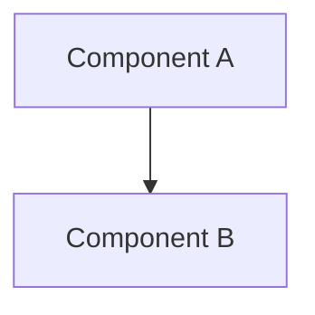

# Diagram Implementation Guide
## Next Steps for MBSE Diagram Creation

**Document Status**: Ready for Implementation  
**Created**: February 8, 2026  
**Last Updated**: February 8, 2026

---

## ✅ What Has Been Completed

### 1. Strategic Planning ✅
- ✅ **DIAGRAM_MASTER_PLAN.md**: Complete strategic plan with all 32 diagrams defined
- ✅ **diagrams/README.md**: Comprehensive diagram directory guide
- ✅ **diagrams/QUICK_REFERENCE.md**: Quick reference card for daily use

### 2. Directory Structure ✅
- ✅ Created organized folder structure:
  - `diagrams/source/` with 8 category subdirectories
  - `diagrams/rendered/` for exported images
  - Mirrors MBSE best practices

### 3. Templates and Examples ✅
- ✅ 6 diagram type templates in `source/` directories:
  - Architecture diagram template
  - Data flow template
  - Gantt chart template
  - State machine template
  - Sequence diagram template
  - Workflow template
- ✅ **Example Diagram**: D1.1 Overall System Context (fully implemented and rendered)

---

## 🚀 Immediate Next Steps (This Week)

### Step 1: Review and Approve Plan
**Owner**: Project Manager + Systems Engineer  
**Effort**: 2 hours  
**Action Items**:
- [ ] Review DIAGRAM_MASTER_PLAN.md
- [ ] Confirm diagram priorities align with project needs
- [ ] Approve allocation of 80-100 hours for diagram creation
- [ ] Assign systems engineer as diagram architect

### Step 2: Set Up Development Environment
**Owner**: Diagram Architect  
**Effort**: 1 hour  
**Action Items**:
- [ ] Install Mermaid Live Editor bookmark: https://mermaid.live
- [ ] Install VS Code Mermaid extension: `bierner.markdown-mermaid`
- [ ] Test rendering example diagram D1.1 in both tools
- [ ] Verify Git access to diagrams directory

### Step 3: Begin Priority 1 Diagrams
**Owner**: Systems Engineer  
**Effort**: 22 hours (Week 1)  
**Action Items**:

#### D1.1 - Overall System Context (6 hours) ✅ COMPLETE
- ✅ Already created in `source/architecture/D1.1_system_context.mmd`
- [ ] Export to PNG and SVG
- [ ] Integrate into 00_WBS_Master_Overview.md Section 1
- [ ] SME review

#### D1.2 - System Hierarchy Decomposition (10 hours)
- [ ] Create `source/architecture/D1.2_system_hierarchy.mmd`
- [ ] Map all WBS elements from sections 2.1-2.6
- [ ] Add color coding by phase
- [ ] Export and integrate into 00_WBS_Master_Overview.md Section 2
- [ ] Review with project team

#### D2.1 - Project Methodology Workflow (6 hours)
- [ ] Create `source/process/D2.1_methodology_workflow.mmd`
- [ ] Show simulation-first approach with stage gates
- [ ] Include decision diamonds for gate approvals
- [ ] Export and integrate into 00_WBS_Master_Overview.md Section 1.2
- [ ] Stakeholder review

**Week 1 Deliverable**: Master Overview document enhanced with 3 foundational diagrams

---

## 📅 4-Week Implementation Roadmap

### Week 1: Foundation Diagrams (Priority 1 Core)
**Focus**: Master Overview enhancement  
**Effort**: 22 hours  
**Diagrams**: 3 (D1.1, D1.2, D2.1)

**Deliverables**:
- Enhanced Master Overview with system context
- Complete WBS hierarchy visualization
- Methodology workflow documented

**Success Criteria**:
- New team members can understand project scope in 10 minutes
- Stakeholders approve high-level architecture

---

### Week 2: System Architecture (Priority 1 + 2)
**Focus**: Technical architecture definition  
**Effort**: 26 hours  
**Diagrams**: 3 (D1.3, D1.4, D1.6)

**Action Items**:
- [ ] **D1.3** - SITL System Architecture (8h)
  - File: `source/architecture/D1.3_sitl_architecture.mmd`
  - Integrate into 02_WBS_Phase2_SITL_Baseline.md
  - Shows Gazebo, dynamics, sensors, PID controller
  
- [ ] **D1.4** - HIL System Architecture (8h)
  - File: `source/architecture/D1.4_hil_architecture.mmd`
  - Integrate into 04_WBS_Phase4_HIL_Flight_Control.md
  - Shows MCU, firmware, HIL bridge, communication
  
- [ ] **D1.6** - End-to-End Integration Architecture (10h)
  - File: `source/architecture/D1.6_integration_architecture.mmd`
  - Integrate into 06_WBS_Phase6_Integration_Validation.md
  - Shows SITL → HIL → Hardware progression

**Deliverables**:
- Phase 2, 4, 6 documents with architecture diagrams
- Clear technical architecture for each stage

**Success Criteria**:
- Engineers can identify all major components
- Interface definitions are clear

---

### Week 3: Process & Data Flow (Priority 1 + 2)
**Focus**: Data flow and processing pipelines  
**Effort**: 26 hours  
**Diagrams**: 4 (D2.2, D3.1, D3.2, D3.3)

**Action Items**:
- [ ] **D2.2** - RL Training Pipeline (8h)
  - File: `source/process/D2.2_rl_training_pipeline.mmd`
  - Integrate into 03_WBS_Phase3_RL_Control.md Section 3.4
  - Shows complete ML workflow from environment design to deployment
  
- [ ] **D3.1** - SITL Data Flow Diagram (6h)
  - File: `source/dataflow/D3.1_sitl_dataflow.mmd`
  - Integrate into 02_WBS_Phase2_SITL_Baseline.md Section 2.5
  - Shows data through dynamics → sensors → controller → actuators
  
- [ ] **D3.2** - HIL Communication Flow (7h)
  - File: `source/dataflow/D3.2_hil_communication.mmd`
  - Integrate into 04_WBS_Phase4_HIL_Flight_Control.md Section 4.4
  - Sequence diagram of Gazebo ↔ HIL Bridge ↔ MCU
  
- [ ] **D3.3** - RL Policy Data Flow (5h)
  - File: `source/dataflow/D3.3_rl_policy_dataflow.mmd`
  - Integrate into 03_WBS_Phase3_RL_Control.md Section 3.2
  - Shows observation → normalization → neural net → action

**Deliverables**:
- Phase 2, 3, 4 with complete data flow clarity
- RL training process fully documented

**Success Criteria**:
- ML engineers understand training pipeline
- Data transformations are traceable

---

### Week 4: Timeline & Components (Priority 1 + 2)
**Focus**: Project scheduling and component specifications  
**Effort**: 29 hours  
**Diagrams**: 4 (D4.1, D4.4, D5.1, D5.2)

**Action Items**:
- [ ] **D4.1** - Master Project Gantt Chart (8h)
  - File: `source/timeline/D4.1_master_gantt.mmd`
  - Integrate into 00_WBS_Master_Overview.md Section 4
  - All 6 phases with milestones and dependencies
  
- [ ] **D4.4** - Phase Dependencies Network (7h)
  - File: `source/timeline/D4.4_phase_dependencies.mmd`
  - Integrate into 00_WBS_Master_Overview.md Section 2
  - DAG showing all subsystem dependencies
  
- [ ] **D5.1** - Software Component Architecture (7h)
  - File: `source/components/D5.1_software_components.mmd`
  - Integrate into 02_WBS_Phase2_SITL_Baseline.md Section 2.2
  - Component diagram with interfaces
  
- [ ] **D5.2** - Firmware Module Architecture (7h)
  - File: `source/components/D5.2_firmware_modules.mmd`
  - Integrate into 04_WBS_Phase4_HIL_Flight_Control.md Section 4.2
  - RTOS tasks, priorities, communication

**Deliverables**:
- Complete project timeline visualization
- Component specifications for software and firmware

**Success Criteria**:
- Project manager can track schedule
- Engineers have clear component interfaces

---

## 🎯 Week 5+ Enhancement Diagrams

After completing Priority 1 and 2 diagrams (18 diagrams, ~104 hours over 4 weeks), continue with Priority 3 and 4 diagrams as time permits.

### Priority 3 Enhancement (11 diagrams - 62 hours)
Focus areas:
- Detailed schedules for each phase
- State machines for behavior modeling
- Requirements decomposition
- Additional component diagrams

### Priority 4 Optional (3 diagrams - 18 hours)
Lower priority, create if time/resources available:
- Requirements process flow
- Traceability matrix visualization
- SITL deployment details

---

## 📊 Progress Tracking

### How to Track Progress

**Update After Each Diagram**:
1. Mark checkbox in this document
2. Update `diagrams/README.md` progress section
3. Update status in DIAGRAM_MASTER_PLAN.md
4. Commit changes with message: "Complete D1.X - [Diagram Name]"

**Weekly Review**:
- Systems engineer presents completed diagrams
- Team provides feedback
- Adjust priorities if needed
- Update this guide with any changes

### Progress Dashboard

Create this table in weekly status reports:

| Week | Planned | Completed | Remaining | % Done |
|------|---------|-----------|-----------|--------|
| 1 | 3 | 0 | 3 | 0% |
| 2 | 3 | 0 | 3 | 0% |
| 3 | 4 | 0 | 4 | 0% |
| 4 | 4 | 0 | 4 | 0% |
| **Total P1+P2** | **18** | **0** | **18** | **0%** |

---

## ⚡ Quick Start Checklist

**For Systems Engineer Starting Diagram Creation:**

### Before Starting Any Diagram:
- [ ] Read relevant WBS document section
- [ ] Review example D1.1 for structure
- [ ] Choose appropriate template from `source/` directory
- [ ] Have Mermaid Live Editor open: https://mermaid.live

### During Diagram Creation:
- [ ] Start with simple structure, iterate to add detail
- [ ] Follow color guidelines (Blue=SW, Green=HW, Purple=RL, etc.)
- [ ] Label all connections with data types/protocols
- [ ] Add notes for complex elements
- [ ] Test rendering frequently

### Before Marking Complete:
- [ ] Run through quality checklist (in diagrams/README.md)
- [ ] SME technical review
- [ ] Export PNG and SVG to `rendered/` directory
- [ ] Link diagram in appropriate WBS markdown document
- [ ] Commit source .mmd file to Git
- [ ] Update progress trackers

---

## 🛠️ Tools Quick Reference

### Mermaid Live Editor (Primary Tool)
**URL**: https://mermaid.live  
**Use**: Draft and test diagrams in browser  
**Export**: SVG, PNG, Markdown

**Workflow**:
1. Open Mermaid Live Editor
2. Copy template from `source/TEMPLATE_*.mmd`
3. Edit and see live preview
4. Export when satisfied
5. Save source to appropriate `source/` directory

### VS Code + Extension (Alternative)
**Extension**: `bierner.markdown-mermaid`  
**Use**: Edit diagrams locally with preview  
**Advantage**: Integrated with Git workflow

**Workflow**:
1. Open `.mmd` file in VS Code
2. Right-click → "Open Preview"
3. Edit source, preview updates automatically
4. Right-click preview → Export as SVG/PNG

---

## 📝 Integration with WBS Documents

### How to Embed Diagrams in Markdown

**Method 1: Direct Mermaid Block (Recommended)**
```markdown
## System Architecture


```

**Method 2: Image Reference**
```markdown
## System Architecture


```

**Method 3: Both (Best Practice)**
```markdown
## System Architecture

See [source diagram](diagrams/source/architecture/D1.1_system_context.mmd)


```

### Placement Guidelines

**Master Overview (00)**:
- Place high-level diagrams in Section 1 (Executive Summary)
- Timeline in Section 4
- Dependencies in Section 2

**Phase Documents (01-06)**:
- Lead with architecture diagram at top of document
- Data flow in relevant subsections
- Component diagrams in detailed WBS sections
- Reference master overview diagrams where appropriate

---

## 🎓 Learning Resources

### Mermaid.js Documentation
- **Official Docs**: https://mermaid.js.org/
- **Syntax Guide**: https://mermaid.js.org/intro/syntax-reference.html
- **Live Examples**: https://mermaid.live/edit

### MBSE Best Practices
- Focus on clarity over complexity
- One diagram, one message
- Use consistent notation
- Validate with stakeholders early
- Iterate based on feedback

### Project-Specific Standards
- See DIAGRAM_MASTER_PLAN.md Section 1.1 (Diagram Philosophy)
- See diagrams/README.md (Styling Guidelines)
- Follow templates in `source/TEMPLATE_*.mmd`

---

## 🚨 Common Pitfalls to Avoid

❌ **Don't**: Create diagrams without reviewing WBS content first  
✅ **Do**: Read and understand the section before diagramming

❌ **Don't**: Make diagrams too complex (>15-20 nodes)  
✅ **Do**: Create multiple simpler diagrams if needed

❌ **Don't**: Use inconsistent colors or notation  
✅ **Do**: Follow established color standards

❌ **Don't**: Create diagrams in isolation  
✅ **Do**: Get SME review early and often

❌ **Don't**: Forget to commit source files  
✅ **Do**: Version control all .mmd files

❌ **Don't**: Let diagrams become outdated  
✅ **Do**: Update diagrams when requirements change

---

## 💬 Getting Help

**Questions About**:
- **Diagram content/accuracy**: Consult SME for that domain
- **Mermaid syntax**: Check official docs or templates
- **Priorities/scheduling**: Discuss with project manager
- **Integration**: Review this guide or ask systems engineer

**Feedback and Improvements**:
- Suggest diagram additions/changes in team meetings
- Propose process improvements via PR/issue
- Share tips and tricks with team

---

## ✅ Success Criteria

### Week 1 Success
- [ ] 3 Priority 1 diagrams complete and integrated
- [ ] Master Overview significantly enhanced
- [ ] Team understands diagram creation workflow

### Month 1 Success
- [ ] All Priority 1 diagrams complete (8 total)
- [ ] All Priority 2 diagrams complete (10 total)
- [ ] WBS documents visually enhanced
- [ ] Positive feedback from stakeholders and engineers

### Overall Success
- [ ] 32 diagrams created and integrated
- [ ] New team members onboard faster
- [ ] Reduced clarification questions (20%+ reduction)
- [ ] Diagrams actively used in reviews and presentations
- [ ] Documentation referenced as exemplar

---

## 📞 Contact and Support

**Diagram Architect**: Systems Engineer  
**Review Panel**: SMEs from each domain  
**Final Approval**: Project Manager

**Document Location**: `WBS/diagrams/IMPLEMENTATION_GUIDE.md`  
**Last Updated**: February 8, 2026  

---

**Ready to start? Begin with D1.2 - System Hierarchy Decomposition!**

See template in: `diagrams/source/architecture/TEMPLATE_architecture.mmd`  
Reference example: `diagrams/source/architecture/D1.1_system_context.mmd`  
Integrate into: `00_WBS_Master_Overview.md` Section 2
