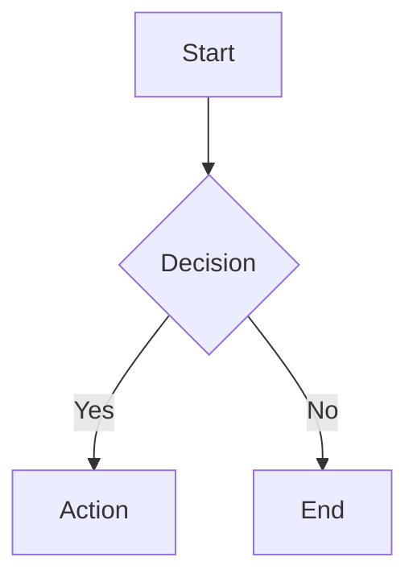
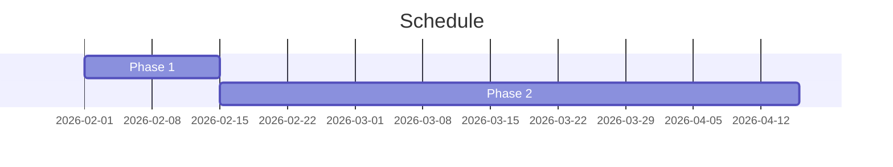
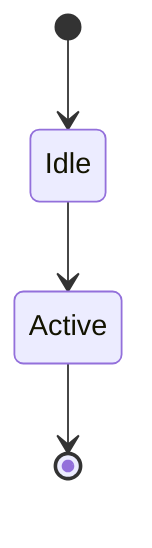
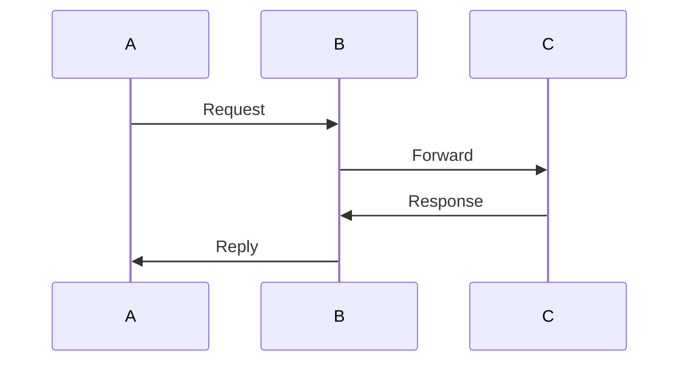

# MBSE Diagram Quick Reference Card
## UAV Flight Controller RL Project

---

## 📋 At-a-Glance Summary

| Metric | Value |
|--------|-------|
| **Total Diagrams** | 32 |
| **Categories** | 8 |
| **Priority 1 (Critical)** | 8 diagrams (~60 hours) |
| **Total Effort** | 80-100 hours |
| **Timeline** | 4-5 weeks |
| **Primary Tool** | Mermaid.js |

---

## 🎯 Top Priority Diagrams (Create First!)

### Week 1 Focus - Foundation

| ID | Diagram Name | Hours | Purpose |
|----|--------------|-------|---------|
| **D1.1** | Overall System Context | 6h | Show complete system boundary |
| **D1.2** | System Hierarchy Decomposition | 10h | Visual WBS hierarchy |
| **D2.1** | Project Methodology Workflow | 6h | Simulation-first approach |
| **D4.1** | Master Project Gantt Chart | 8h | Complete timeline |

### Week 2 Focus - Architecture

| ID | Diagram Name | Hours | Purpose |
|----|--------------|-------|---------|
| **D1.3** | SITL System Architecture | 8h | Software-in-the-loop details |
| **D1.4** | HIL System Architecture | 8h | Hardware-in-the-loop integration |
| **D1.6** | Integration Architecture | 10h | SITL → HIL → Hardware |

### Week 3 Focus - Data Flow

| ID | Diagram Name | Hours | Purpose |
|----|--------------|-------|---------|
| **D2.2** | RL Training Pipeline | 8h | Complete ML workflow |
| **D3.1** | SITL Data Flow | 6h | Simulation data paths |

---

## 🗂️ Diagram Categories

### 1️⃣ System Architecture (6 diagrams - 48h)
Complete system views from context to detailed subsystems

### 2️⃣ Process & Workflow (5 diagrams - 29h)
How work flows through the project lifecycle

### 3️⃣ Data & Information Flow (4 diagrams - 24h)
How data moves through systems

### 4️⃣ Timeline & Scheduling (4 diagrams - 25h)
When things happen and dependencies

### 5️⃣ Component & Interface (5 diagrams - 29h)
Software/hardware modules and connections

### 6️⃣ Behavioral & State (4 diagrams - 20h)
System behavior and state transitions

### 7️⃣ Requirements & Traceability (2 diagrams - 18h)
Requirements hierarchy and verification

### 8️⃣ Deployment & Integration (2 diagrams - 8h)
Physical/logical deployment views

---

## 🎨 Mermaid Diagram Type Cheatsheet

### Flowchart (Most Versatile)

**Use for**: Architecture, data flow, processes

### Gantt Chart

**Use for**: Timelines, project schedules

### State Diagram

**Use for**: Operational modes, state machines

### Sequence Diagram

**Use for**: Interactions, protocols, timing

---

## 🎨 Color Standards

| Color | Hex | Use For |
|-------|-----|---------|
| Blue | `#4A90E2` | Software, simulation |
| Green | `#7ED321` | Hardware, physical |
| Orange | `#F5A623` | Data flows, communication |
| Red | `#D0021B` | Errors, safety, failures |
| Purple | `#9013FE` | RL/AI, neural networks |
| Gray | `#9B9B9B` | Infrastructure, support |

---

## 📍 Where Diagrams Go

| WBS Document | Key Diagrams |
|--------------|--------------|
| **00 - Master Overview** | D1.1, D1.2, D2.1, D4.1, D4.4 (5 diagrams) |
| **01 - Infrastructure** | D2.3, D2.4, D2.5, D6.3, D7.1, D7.2 (6 diagrams) |
| **02 - SITL** | D1.3, D3.1, D3.4, D4.2, D5.1, D5.3, D8.1 (7 diagrams) |
| **03 - RL Control** | D2.2, D3.3, D4.3, D5.5, D6.2 (5 diagrams) |
| **04 - HIL** | D1.4, D3.2, D5.2, D6.1, D6.4, D8.2 (6 diagrams) |
| **05 - Hardware** | D1.5, D5.4 (2 diagrams) |
| **06 - Integration** | D1.6 (1 diagram) |

---

## ✅ Quality Checklist (Before Publishing)

- [ ] Clarity: Understandable in <2 minutes?
- [ ] Accuracy: Technically correct?
- [ ] Completeness: All elements included?
- [ ] Consistency: Standard notation/colors?
- [ ] Labeling: All elements labeled?
- [ ] Traceability: Links to requirements?
- [ ] Rendering: Displays correctly?
- [ ] Referenced: Linked in WBS docs?
- [ ] Version Control: Source committed?

---

## 🚀 Workflow

```
1. PLAN → Review WBS, choose diagram type
2. DRAFT → Create .mmd in source/, use Mermaid Live Editor
3. REVIEW → Self-check, SME validation
4. INTEGRATE → Export PNG/SVG, link in WBS doc
5. MAINTAIN → Update as project evolves
```

---

## 🔗 Essential Links

- **Mermaid Live Editor**: https://mermaid.live
- **Mermaid Docs**: https://mermaid.js.org/
- **Diagram Directory**: `WBS/diagrams/`
- **Master Plan**: `WBS/DIAGRAM_MASTER_PLAN.md`

---

## 📊 Progress Tracker

| Priority | Total | Done | % |
|----------|-------|------|---|
| P1 (⭐) | 8 | 0 | 0% |
| P2 | 10 | 0 | 0% |
| P3 | 11 | 0 | 0% |
| P4 | 3 | 0 | 0% |
| **TOTAL** | **32** | **0** | **0%** |

---

## 💡 Tips for Success

✅ **Start Simple**: Begin with Priority 1 diagrams
✅ **Use Templates**: Reuse patterns from similar diagrams
✅ **Iterate**: Draft → Review → Refine → Publish
✅ **Get Feedback**: Show drafts to target audience early
✅ **Keep Updated**: Diagrams are living documents
✅ **Version Control**: Commit source files, not just images
✅ **Automate**: Use CI/CD to render diagrams automatically

---

**Print this card and keep it handy during diagram creation!**

Last Updated: February 8, 2026
