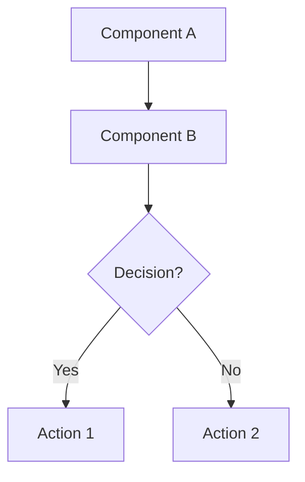
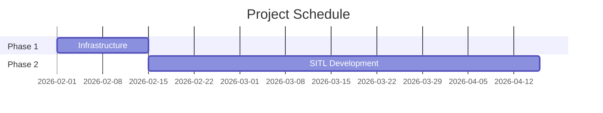
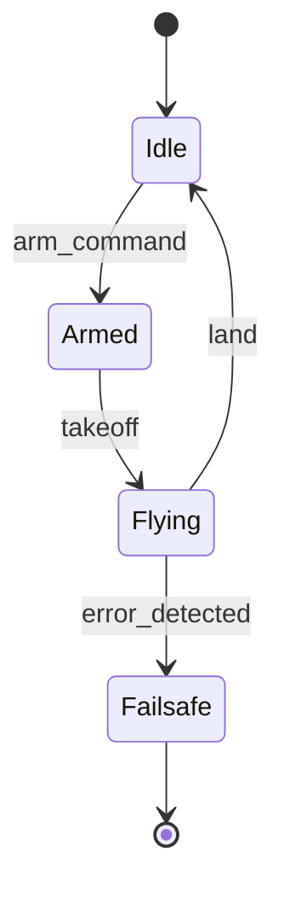
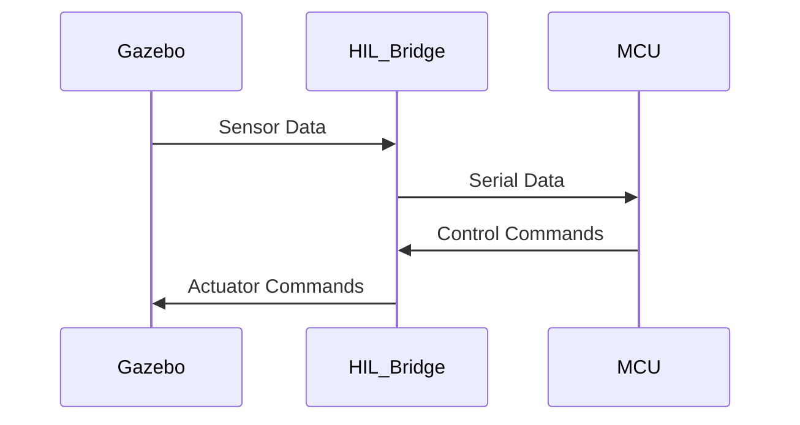
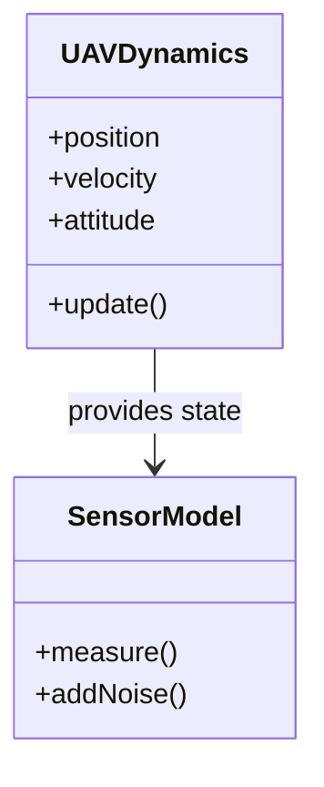

# MBSE Diagrams Directory
## UAV Flight Controller RL Project - Visual Documentation

---

## 📚 Quick Reference

**Total Diagrams Planned**: 32 diagrams across 8 categories
**Current Status**: Directory initialized, ready for diagram creation
**Primary Tool**: Mermaid.js (text-based, version control friendly)
**For Details**: See [DIAGRAM_MASTER_PLAN.md](../DIAGRAM_MASTER_PLAN.md)

---

## 📁 Directory Structure

```
diagrams/
├── README.md                    ← You are here
├── source/                      ← Mermaid.js source files (.mmd)
│   ├── architecture/            ← System architecture diagrams (6)
│   ├── process/                 ← Process and workflow diagrams (5)
│   ├── dataflow/                ← Data and information flow (4)
│   ├── timeline/                ← Gantt charts and schedules (4)
│   ├── components/              ← Component and interface diagrams (5)
│   ├── behavioral/              ← State machines and sequences (4)
│   ├── requirements/            ← Requirements and traceability (2)
│   └── deployment/              ← Deployment diagrams (2)
└── rendered/                    ← Auto-generated PNG/SVG exports
    └── [mirrors source/ structure]
```

---

## 🎯 Diagram Index by Category

### Category 1: System Architecture (6 diagrams)

| ID | Name | Priority | Effort | WBS Document | Status |
|----|------|----------|--------|--------------|--------|
| **D1.1** | Overall System Context Diagram | ⭐ P1 | 6h | 00_Master_Overview | 📋 Planned |
| **D1.2** | System Hierarchy Decomposition | ⭐ P1 | 10h | 00_Master_Overview | 📋 Planned |
| **D1.3** | SITL System Architecture | ⭐ P2 | 8h | 02_Phase2_SITL | 📋 Planned |
| **D1.4** | HIL System Architecture | ⭐ P2 | 8h | 04_Phase4_HIL | 📋 Planned |
| **D1.5** | Custom Hardware System Architecture | P3 | 6h | 05_Phase5_Hardware | 📋 Planned |
| **D1.6** | End-to-End Integration Architecture | ⭐ P2 | 10h | 06_Phase6_Integration | 📋 Planned |

### Category 2: Process & Workflow (5 diagrams)

| ID | Name | Priority | Effort | WBS Document | Status |
|----|------|----------|--------|--------------|--------|
| **D2.1** | Project Methodology Workflow | ⭐ P1 | 6h | 00_Master_Overview | 📋 Planned |
| **D2.2** | RL Training Pipeline | ⭐ P1 | 8h | 03_Phase3_RL | 📋 Planned |
| **D2.3** | Stage Gate Review Process | P3 | 5h | 01_Phase1_Infrastructure | 📋 Planned |
| **D2.4** | CI/CD Pipeline Architecture | P3 | 6h | 01_Phase1_Infrastructure | 📋 Planned |
| **D2.5** | Requirements Management Process | P4 | 4h | 01_Phase1_Infrastructure | 📋 Planned |

### Category 3: Data & Information Flow (4 diagrams)

| ID | Name | Priority | Effort | WBS Document | Status |
|----|------|----------|--------|--------------|--------|
| **D3.1** | SITL Data Flow Diagram | ⭐ P1 | 6h | 02_Phase2_SITL | 📋 Planned |
| **D3.2** | HIL Communication Flow | ⭐ P2 | 7h | 04_Phase4_HIL | 📋 Planned |
| **D3.3** | RL Policy Data Flow | ⭐ P2 | 5h | 03_Phase3_RL | 📋 Planned |
| **D3.4** | Control Loop Cascade Architecture | P3 | 6h | 02_Phase2_SITL | 📋 Planned |

### Category 4: Timeline & Scheduling (4 diagrams)

| ID | Name | Priority | Effort | WBS Document | Status |
|----|------|----------|--------|--------------|--------|
| **D4.1** | Master Project Gantt Chart | ⭐ P1 | 8h | 00_Master_Overview | 📋 Planned |
| **D4.2** | Phase 2 (SITL) Detailed Schedule | P3 | 5h | 02_Phase2_SITL | 📋 Planned |
| **D4.3** | Phase 3 (RL) Detailed Schedule | P3 | 5h | 03_Phase3_RL | 📋 Planned |
| **D4.4** | Phase Dependencies Network | ⭐ P2 | 7h | 00_Master_Overview | 📋 Planned |

### Category 5: Component & Interface (5 diagrams)

| ID | Name | Priority | Effort | WBS Document | Status |
|----|------|----------|--------|--------------|--------|
| **D5.1** | Software Component Architecture | ⭐ P2 | 7h | 02_Phase2_SITL | 📋 Planned |
| **D5.2** | Firmware Module Architecture | ⭐ P2 | 7h | 04_Phase4_HIL | 📋 Planned |
| **D5.3** | ROS Node and Topic Graph | P3 | 5h | 02_Phase2_SITL | 📋 Planned |
| **D5.4** | Hardware Interface Specifications | P3 | 6h | 05_Phase5_Hardware | 📋 Planned |
| **D5.5** | Neural Network Architecture Diagram | ⭐ P2 | 4h | 03_Phase3_RL | 📋 Planned |

### Category 6: Behavioral & State (4 diagrams)

| ID | Name | Priority | Effort | WBS Document | Status |
|----|------|----------|--------|--------------|--------|
| **D6.1** | Flight Controller State Machine | ⭐ P2 | 6h | 04_Phase4_HIL | 📋 Planned |
| **D6.2** | RL Training State Machine | P3 | 5h | 03_Phase3_RL | 📋 Planned |
| **D6.3** | Stage Gate Transition State Diagram | P3 | 4h | 01_Phase1_Infrastructure | 📋 Planned |
| **D6.4** | HIL Simulation Sequence Diagram | P3 | 5h | 04_Phase4_HIL | 📋 Planned |

### Category 7: Requirements & Traceability (2 diagrams)

| ID | Name | Priority | Effort | WBS Document | Status |
|----|------|----------|--------|--------------|--------|
| **D7.1** | Requirements Decomposition Tree | P3 | 8h | 01_Phase1_Infrastructure | 📋 Planned |
| **D7.2** | Traceability Matrix Visualization | P4 | 10h | 01_Phase1_Infrastructure | 📋 Planned |

### Category 8: Deployment & Integration (2 diagrams)

| ID | Name | Priority | Effort | WBS Document | Status |
|----|------|----------|--------|--------------|--------|
| **D8.1** | SITL Deployment Diagram | P4 | 4h | 02_Phase2_SITL | 📋 Planned |
| **D8.2** | HIL Physical Setup Diagram | P3 | 4h | 04_Phase4_HIL | 📋 Planned |

**Legend**: 
- ⭐ = Priority 1 (critical, create first)
- P2 = Priority 2 (important)
- P3 = Priority 3 (enhancement)  
- P4 = Priority 4 (nice to have)

---

## 🚀 Quick Start Guide

### Creating a New Diagram

1. **Choose Diagram Type**: Select appropriate Mermaid diagram type (see templates below)
2. **Create Source File**: 
   ```bash
   # Example: Create architecture diagram
   # File: source/architecture/D1.1_system_context.mmd
   ```
3. **Write Mermaid Code**: Use Mermaid Live Editor for development: https://mermaid.live
4. **Test Rendering**: Verify diagram renders correctly
5. **Export**: Save both `.mmd` source and rendered PNG/SVG
6. **Reference in WBS**: Link diagram in appropriate WBS markdown document

### Mermaid.js Diagram Type Reference

#### Flowchart / Block Diagram


**Use for**: System architecture, data flow, process workflows

#### Gantt Chart


**Use for**: Timelines, schedules, project planning

#### State Diagram


**Use for**: Behavioral models, state machines, operational modes

#### Sequence Diagram


**Use for**: Interaction flows, communication protocols, timing

#### Class/Component Diagram


**Use for**: Software architecture, interfaces, object models

---

## 🎨 Styling Guidelines

### Color Palette (Consistent Across All Diagrams)

- **Blue (`#4A90E2`)**: Software components, simulation elements
- **Green (`#7ED321`)**: Hardware components, physical elements  
- **Orange (`#F5A623`)**: Data flows, communication paths
- **Red (`#D0021B`)**: Error paths, safety systems, failures
- **Purple (`#9013FE`)**: RL/AI components, neural networks
- **Gray (`#9B9B9B`)**: Infrastructure, support systems

### Notation Standards

- **Rectangles**: Processes, components, subsystems
- **Rounded rectangles**: Interfaces, external systems
- **Diamonds**: Decision points, gates
- **Circles**: Start/end points, states
- **Arrows**: Data flow, control flow, dependencies
  - Solid: Primary/required flow
  - Dashed: Optional/conditional flow
  - Bold: Critical path

### Label Guidelines

- Use clear, concise labels (2-5 words)
- Include units where applicable (Hz, ms, bytes)
- Add frequency/timing for real-time systems
- Annotate interfaces with protocols (I2C, UART, ROS topic)

---

## 🔧 Tools and Resources

### Recommended Tools

**Primary Development**:
- **Mermaid Live Editor**: https://mermaid.live (browser-based, instant preview)
- **VS Code + Mermaid Extension**: `bierner.markdown-mermaid` (local editing with preview)

**Alternative Tools**:
- **draw.io**: https://app.diagrams.net (for complex diagrams beyond Mermaid capabilities)
- **PlantUML**: Alternative text-based diagramming (if preferred)

### Mermaid Documentation

- Official Docs: https://mermaid.js.org/
- Syntax Reference: https://mermaid.js.org/intro/syntax-reference.html
- Examples Gallery: https://mermaid.js.org/ecosystem/integrations.html

### Export Options

**From Mermaid Live Editor**:
- SVG (scalable, best for documents)
- PNG (raster, good for presentations)
- Markdown (embed directly)

**From VS Code**:
- Right-click diagram → Export as SVG/PNG

---

## 📝 Diagram Creation Workflow

### Standard Workflow

```
1. Plan
   ├─ Review WBS section
   ├─ Identify diagram purpose and audience
   └─ Choose appropriate diagram type

2. Draft
   ├─ Create .mmd file in appropriate subdirectory
   ├─ Develop diagram in Mermaid Live Editor
   └─ Iterate on layout and clarity

3. Review
   ├─ Self-review against quality checklist
   ├─ SME technical review
   └─ Stakeholder review (if appropriate)

4. Integrate
   ├─ Export to rendered/ directory (PNG + SVG)
   ├─ Link in WBS markdown document
   └─ Commit source file to version control

5. Maintain
   ├─ Update when requirements change
   ├─ Validate at stage gates
   └─ Keep in sync with implementation
```

### Quality Checklist ✅

Before considering a diagram complete:

- [ ] **Clarity**: Can target audience understand in <2 minutes?
- [ ] **Accuracy**: Technically correct (SME validated)?
- [ ] **Completeness**: All relevant elements included?
- [ ] **Consistency**: Uses standard notation and colors?
- [ ] **Labeling**: All elements clearly labeled?
- [ ] **Traceability**: Traces to WBS requirements?
- [ ] **Rendering**: Displays correctly in all formats?
- [ ] **Documentation**: Referenced in appropriate WBS document?
- [ ] **Version Control**: Source file committed to Git?

---

## 📊 Progress Tracking

### Overall Statistics

- **Total Planned**: 32 diagrams
- **Completed**: 24 ✅
- **In Progress**: 0
- **Not Started**: 8
- **Rendered**: 24 PNG (4K) + 24 SVG files (~4.2 MB total)

### By Priority

| Priority | Total | Complete | Remaining | % Done |
|----------|-------|----------|-----------|--------|
| Priority 1 (⭐) | 8 | 6 | 2 | 75% |
| Priority 2 | 10 | 10 | 0 | 100% ✅ |
| Priority 3 | 11 | 8 | 3 | 73% |
| Priority 4 | 3 | 0 | 3 | 0% |

### By Category

| Category | Total | Complete | Remaining |
|----------|-------|----------|-----------|
| 1. System Architecture | 6 | 5 | 1 |
| 2. Process & Workflow | 5 | 3 | 2 |
| 3. Data & Information Flow | 4 | 3 | 1 |
| 4. Timeline & Scheduling | 4 | 2 | 2 |
| 5. Component & Interface | 5 | 5 | 0 ✅ |
| 6. Behavioral & State | 4 | 4 | 0 ✅ |
| 7. Requirements & Traceability | 2 | 0 | 2 |
| 8. Deployment & Integration | 2 | 1 | 1 |

### Recent Activity (2026-02-08)

**✅ Priority 1 & 2 Complete** (16 diagrams)

**✅ Priority 3 - Session 2** (8 NEW diagrams):
- D1.5 - Custom Hardware Architecture ⚡
- D2.3 - RL Hyperparameter Tuning ⚡
- D5.3 - Sensor Interface Diagram ⚡
- D5.4 - Motor Control Architecture ⚡
- D6.2 - RL Training State Machine ⚡
- D6.3 - Initialization Sequence ⚡
- D6.4 - Emergency Shutdown Sequence ⚡
- D8.2 - HIL Physical Setup ⚡

**🎨 Rendered**: All 24 diagrams exported to PNG (4K resolution) + SVG format

## 🗓️ Implementation Roadmap

### Week 1: Foundation (Priority 1 Core)
- [ ] D1.1 - Overall System Context (6h)
- [ ] D1.2 - System Hierarchy Decomposition (10h)
- [ ] D2.1 - Project Methodology Workflow (6h)

### Week 2: System Architecture
- [ ] D1.3 - SITL Architecture (8h)
- [ ] D1.4 - HIL Architecture (8h)
- [ ] D1.6 - Integration Architecture (10h)

### Week 3: Process & Data Flow
- [ ] D2.2 - RL Training Pipeline (8h)
- [ ] D3.1 - SITL Data Flow (6h)
- [ ] D3.2 - HIL Communication Flow (7h)
- [ ] D3.3 - RL Policy Data Flow (5h)

### Week 4: Timeline & Components
- [ ] D4.1 - Master Gantt Chart (8h)
- [ ] D4.4 - Phase Dependencies (7h)
- [ ] D5.1 - Software Components (7h)
- [ ] D5.2 - Firmware Modules (7h)

### Week 5+: Enhancement Diagrams
- [ ] Remaining Priority 2 diagrams
- [ ] Priority 3 and 4 diagrams as time permits
- [ ] Diagram refinement based on feedback

---

## 🤝 Contributing

### Adding a New Diagram

1. Check if diagram already planned (see index above)
2. If new diagram needed:
   - Propose in team meeting or via issue/PR
   - Assign diagram ID following naming convention
   - Add to this README index
3. Create diagram following workflow above
4. Submit for review

### Updating Existing Diagram

1. Identify diagram needing update
2. Modify `.mmd` source file in `source/` directory
3. Re-export to `rendered/` directory
4. Update WBS document references if needed
5. Commit with descriptive message: `Update D1.3: Added motor model detail`

---

## 📞 Support

**Questions or Issues?**
- Review [DIAGRAM_MASTER_PLAN.md](../DIAGRAM_MASTER_PLAN.md) for detailed guidance
- Consult Mermaid documentation: https://mermaid.js.org/
- Ask systems engineer or diagram architect
- Submit issue/question in team communication channel

---

## 📚 Related Documentation

- [DIAGRAM_MASTER_PLAN.md](../DIAGRAM_MASTER_PLAN.md) - Complete strategic plan
- [00_WBS_Master_Overview.md](../00_WBS_Master_Overview.md) - Project overview
- [00_README.md](../00_README.md) - WBS documentation guide

---

**Last Updated**: February 8, 2026  
**Maintained By**: Systems Engineering Team  
**Status**: Active - Diagram creation in planning phase
