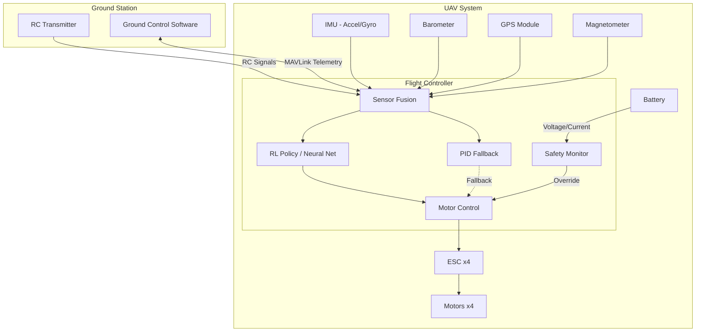

# System Architecture Overview

## System Context

The UAV flight controller system operates within the following context:

## Development Stages

## Key Design Decisions

1. **ROS 2 Jazzy** — LTS through May 2029, widest package ecosystem
2. **Gazebo Harmonic** — Tight ROS 2 integration, modern rendering
3. **Stable-Baselines3** — Well-documented PPO/SAC implementations
4. **FreeRTOS** — Industry-standard embedded RTOS, large community
5. **PID Fallback** — Safety-critical backup ensures flyable state at all times
