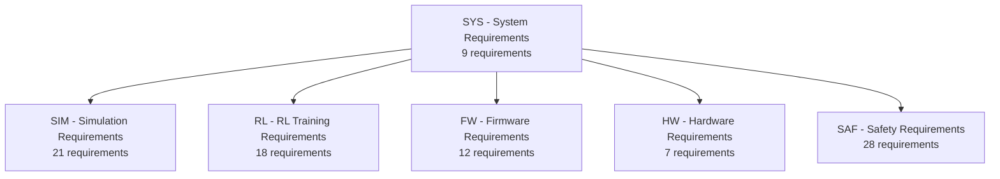

# Requirements Database

## Overview

Requirements are managed using [Doorstop](https://doorstop.readthedocs.io/), an open-source requirements management tool that stores requirements as YAML files in version control.

## Document Hierarchy



| Document | Prefix | Count | Scope |
|----------|--------|-------|-------|
| System | SYS | 9 | Top-level project requirements |
| Simulation | SIM | 21 | SITL environment, sensor models, PID baseline |
| RL Training | RL | 18 | Observation/action spaces, policy architecture, training |
| Firmware | FW | 12 | MCU selection, RTOS, real-time inference, HIL |
| Hardware | HW | 7 | PCB design, power, interfaces |
| Safety | SAF | 28 | Fault detection, flight envelope, emergency response |
| **Total** | | **95** | |

## Working with Requirements

### View requirements

```bash
doorstop publish all docs/requirements/output/
```

### Add a new requirement

```bash
doorstop add SIM  # adds next SIM-xxx requirement
doorstop edit SIM022  # edit in your default editor
```

### Link requirements (traceability)

```bash
doorstop link SIM001 SYS001  # SIM-001 traces to SYS-001
```

### Validate traceability

```bash
doorstop
```

## Requirement Categories

### System (SYS)
Top-level requirements governing the overall project: stage-gate process, cross-stage testing, documentation, and resource monitoring.

### Simulation (SIM)
Covers the Gazebo simulation environment, UAV dynamics model, sensor models (IMU, barometer, GPS), PID baseline controller performance, and SITL verification testing.

### Reinforcement Learning (RL)
Defines the observation/action spaces, neural network architecture (2×128 MLP, ≤19K parameters), training pipeline, convergence criteria, and INT8 quantization for embedded deployment.

### Firmware (FW)
MCU minimum specs (≥168 MHz, ≥256 KB RAM), RTOS architecture, real-time inference (<5 ms), control loop timing (≥100 Hz, <1 ms jitter), and HIL communication protocol.

### Hardware (HW)
Custom PCB requirements: power regulation, layer stackup, sensor/actuator interfaces, environmental tolerance, DRC compliance, and BOM management.

### Safety (SAF)
Comprehensive safety system: 100 Hz safety monitor, hardware watchdog, sensor fault detection, flight envelope limits (100 m altitude, ±45° tilt, 15 m/s velocity, 500 m geofence), RL inference watchdog with PID fallback, battery monitoring, thermal protection, 5-state safety FSM, pre-flight checks, black-box logging, and crash detection.
