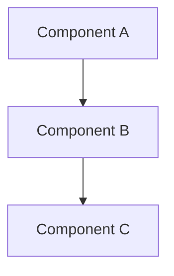

# Design Document

**Document ID:** DD-[SUBSYSTEM]-[VERSION]
**Subsystem:** [Simulation / Firmware / Training / Hardware]
**Version:** [1.0]
**Date:** [YYYY-MM-DD]
**Author:** [Name]
**Status:** [Draft / Under Review / Approved]

---

## 1. Overview

### 1.1 Purpose

[What problem does this design solve? Which requirements does it address?]

### 1.2 Scope

[What is covered by this design document and what is out of scope.]

### 1.3 Related Requirements

[List Doorstop requirement IDs: SYS-001, SIM-005, etc.]

## 2. Architecture

### 2.1 High-Level Design

[Block diagram or system architecture. Use Mermaid where possible.]



### 2.2 Component Descriptions

| Component | Responsibility | Interface |
|-----------|---------------|-----------|
| | | |

### 2.3 Data Flow

[Describe how data flows through the system.]

## 3. Detailed Design

### 3.1 [Module 1]

**Purpose:** [What this module does]
**Inputs:** [Input data/signals]
**Outputs:** [Output data/signals]
**Algorithm:** [Key algorithms or logic]

### 3.2 [Module 2]

## 4. Interface Design

### 4.1 API Specification

```python
def function_name(param1: type, param2: type) -> return_type:
    """Docstring describing the function."""
```

### 4.2 Message Formats

### 4.3 Configuration Parameters

| Parameter | Type | Default | Range | Description |
|-----------|------|---------|-------|-------------|
| | | | | |

## 5. Design Decisions & Trade-offs

| Decision | Options Considered | Choice | Rationale |
|----------|-------------------|--------|-----------|
| | | | |

## 6. Error Handling

[Describe error conditions and how they are handled.]

## 7. Testing Strategy

[How will this design be validated? Reference test plan.]

## 8. Revision History

| Version | Date | Author | Changes |
|---------|------|--------|---------|
| 1.0 | | | Initial draft |
